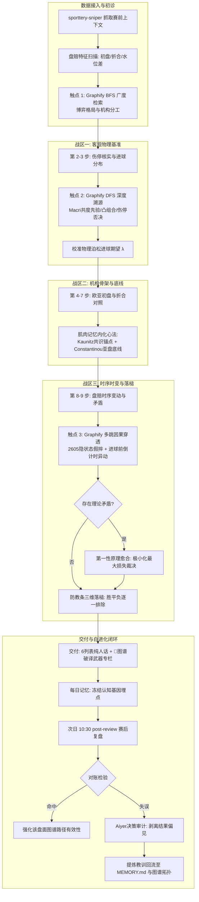

## Goal Capsule

- **Objective:** 彻底告别知识图谱“静态死数据”与推演时“单点翻书为时已晚”的弊端。将全库 19 篇顶尖博弈学术文献（536 页）与 18 本实战手册构建的 Graphify 认知图谱，全面升级为贯穿足球推演全流程的**高频多触点深广检索、自动脱靶愈合与赛后基因自进化闭环推演大脑**。
- **Means:** 实施“「常驻心法直觉 × 动态图谱调兵」双轨推演机制 +「战前盘面扫描锁定 + 客观与时序两段分层穿透」+「纯通俗人话六列表 + 表下显式破译武器专栏」+ 赛后基因对账回流”四大核心机制，通过对推演技能手册（`deep-analysis`、`post-review`、`recommendation`）及系统规范（`AGENTS.md`）进行极简微调，全权依托 AI 大模型的意图穿透与因果逻辑，零业务代码实现系统认知自进化。
- **Product Authority:** 遵循主人最高立宪铁律：严禁编写任何推演决策、倍率破译或死尺子门禁代码；系统优化严格遵循“主要做减法、其次做微调、慎重做加法”原则；所有推演与自进化全权依托大模型主观意图与 Graphify 拓扑联动。
- **Stop Conditions:** 技能手册微调完毕且语法自洽；全流程 3 个检索触点与自愈规则明确；6 列表专栏展示与赛前基因埋点落地；赛后复盘自进化对账规则确立；`scripts/check_consistency.py --print-ok` 满分通过，图谱 0 孤岛。
- **Execution Profile:** 纯 Markdown 技能规范与系统指南微调（`execution: code` 处理仓库文档工件）。

---

## Product Contract

### Summary
本方案为足球倍率分析推演系统确立高频多触点深广图谱检索与自愈自进化闭环机制。在单场深度分析中，大模型在战前初诊（BFS 广搜）、物理基准（DFS 进球穿透）与时序变动（多跳假摔穿透）三大战区高频调兵，遭遇脱靶或矛盾时由第一性原理自动自愈；推演报告保持通俗大白话并在表格下方独立亮明「🎯 图谱破译武器」；赛前推理链作为认知基因埋点沉淀，赛后复盘通过 Aiyer 决策审计对照赛果，错因自动回流沉淀进 `MEMORY.md` 与图谱拓扑，驱动系统实战自进化。

### Problem Frame
1. **静态孤岛与检索过晚**：此前 39 个核心博弈概念虽已注入 `graph.json`，但大模型推演时缺乏动态调兵机制。若仅在第 8 步（变动解读）单点检索，前序的第 2~3 步（客观伤停与泊松基准）和第 4~7 步（欧亚初盘与防守底线）早已因缺乏学术武器而定歪基准；
2. **缺乏检索容错与矛盾收敛（自愈缺失）**：推演中若关键词检索未命中，大模型容易退回经验主义盲猜；若欧亚理论出现结论冲突，缺乏基于庄家“极小化最大损失”第一性原理的自愈收敛机制；
3. **推演与复盘缺乏因果闭环（进化断层）**：赛前推演的学术武器没有作为结构化“认知基因”留痕，赛后复盘往往只核对红黑输赢，无法反向检验当场图谱推理链的有效性，导致系统无法从实战中沉淀经验以实现真正的自进化。

### Key Decisions
- **KD1. 交互机制采用「常驻心法直觉 × 动态图谱调兵」双轨推演机制**：三战区核心心法常驻技能（形成肌肉记忆）+ 单场 worker 动态自主查图（调出特种武器）。
  *(session-settled: user-directed — chosen over 纯动态自主或纯静态Prompt: 兼顾常规推演效率与异动特种破局能力。Governs R1, R2)*
- **KD2. 检索时机采用「战前盘面扫描锁定 + 客观与时序两段分层穿透」**：推演前必查盘赔特征，基准战区查进球/伤停模型，时序战区查假摔/防守底线。
  *(session-settled: user-directed — chosen over 仅疑点触发: 战前盘面扫描锁定武器，两段式分层筑牢物理基准与博弈时序双道防线。Governs R2, R3)*
- **KD3. 交付呈现采用「纯通俗人话六列表 + 表下显式破译武器专栏」**：6 列表内部保持极致大白话人话剧本，表格下方单独附带 2~3 行「🎯 图谱破译武器」专栏；深入细节按需展开，赛后复盘全量对账。
  *(session-settled: user-directed — chosen over 纯大白话隐藏或大篇幅堆砌: 6 列表通俗好懂，专栏清晰亮剑，深入细节按需展开。Governs R4)*
- **KD4. 建立认知基因埋点与赛后自进化闭环**：赛前推演将图谱节点 ID 与假设链冻结进每日记忆，赛后复盘对照真实赛果进行 Aiyer 决策审计，错因自动提炼回流至 `MEMORY.md`。
  *(session-settled: user-directed — chosen over 仅统计红黑战绩: 让系统每打一场球就自动修复一个认知盲区，实现真正的自生长。Governs R5)*

### Requirements

#### 模块一：高频深广检索与三战区渗透 (High-Frequency & Multi-Touchpoint)
- R1. **战前盘面初诊广度扫描（触点 1）**：在运行 `sporttery-sniper` 获得数据后，大模型必须首先提炼当场 1~2 个核心盘赔异动特征（如：平赔虚降、升盘阻热、欧亚背离），调用 `graphify query` 发起广度遍历（BFS depth=2~3），抓取全市场博弈大局与机构职能分工。
- R2. **物理基准战区深度因果穿透（触点 2）**：在第 2~3 步分析伤停与泊松建模时，针对中轴伤停与进球特征，调用图谱进行深度溯源（DFS/path 穿透），精确调取并执行 Macri(2025) 对角膨胀平局修正、1802.08848 攻防凸组合或《下注决策手册》极端伤停一票否决。
- R3. **博弈时序战区多跳异动穿透（触点 3）**：在第 8~9 步解读盘赔时序与关键矛盾时，针对急变水与盘水矛盾，再次发起多跳穿透，调取 2605.30209 隐状态假摔识别与 Constantinou(2022) 让球防守底线，形成跨市场多证据合围。

#### 模块二：可自愈机制 (Self-Healing Architecture)
- R4. **脱靶自愈与语义升维**：单场检索若关键词命中节点过少或无直接概念，禁止放弃；大模型必须自动执行语义升维（如从口语“早盘跳水”升维至“散户认知偏差”或查询 `god_nodes`），保障武器库有效调出。
- R5. **理论矛盾自愈与第一性原理收敛**：若不同文献概念在当场指向相反结果（如欧指看主胜、亚盘看客不败），大模型必须调用图谱中的 `shortest_path` 与矛盾裁决逻辑，严格以庄家“极小化最大损失”第一性原理为准绳裁决，让球盘防守底线优先于欧指表面宣传，三端写清证据，消除认知分裂。

#### 模块三：交付与沉淀规范 (Delivery & Cognitive Genetics)
- R6. **6 列表极致大白话 + 武器专栏显式亮剑**：分析报告中的 6 列表内部必须完全使用 90 岁老奶奶听得懂的纯通俗人话；在表格正下方单独附带 2~3 行「🎯 图谱破译武器」专栏，清晰展示当场调用的文献理论、作者及实盘破译对应。
- R7. **认知基因冻结埋点**：单场分析完成写入 `memory/YYYY-MM-DD.md` 结构化摘要时，必须将当场采纳的“图谱节点 ID、原文依据与假设演绎链”作为认知基因完整冻结留痕。

#### 模块四：赛后复盘自进化闭环 (Self-Evolving Loop)
- R8. **赛后基因对账与 Aiyer 决策审计**：每日 10:30 执行 `post-review` 时，必须提取赛前冻结的认知基因埋点，对照真实赛果进行深度审计：严格区分“小概率随机爆冷（过程完美）”与“误判庄家底牌（认知缺陷）”。
- R9. **教训回流与图谱动态自进化**：复盘发现认知缺陷后，当场提炼出具可操作性的实战规则，同步更新追加至 `MEMORY.md` 策略调优记录与图谱新关联，彻底闭环自进化。

### Key Flows
- F1. **单场推演全生命周期流**：
  1. 数据就绪 ➔ 提取盘赔特征 ➔ 触点 1 广度查图（定博弈大格局）；
  2. 第 2~3 步 ➔ 触点 2 深度查图（定物理进球基准与伤停修正）；
  3. 第 4~7 步 ➔ 肌肉记忆拆解欧亚骨架与共识无偏锚点；
  4. 第 8~9 步 ➔ 触点 3 时序查图（穿透假摔做市，三维落槌排除）；
  5. 输出交付 ➔ 6 列表纯人话 + 下方「🎯 图谱破译武器」专栏；
  6. 写入记忆 ➔ 冻结认知基因埋点（节点 ID + 假设演绎链）。
- F2. **赛后对账与自进化回流流**：
  1. 抓取真实赛果 ➔ 读取赛前认知基因埋点；
  2. 理论验证 ➔ 命中则强化该路径；失误则启动 Aiyer 决策审计；
  3. 提炼教训 ➔ 更新 `MEMORY.md` 并沉淀新拓扑关联，完成进化。

### Acceptance Examples
- AE1. **早盘平赔虚降场次推演验收**：
  - **Given:** 某场赛事初盘均势，早盘欧指平赔从 3.30 骤降至 3.05，而亚盘平半高水维持不动；
  - **When:** worker 执行深度分析；
  - **Then:** 触点 1 和 触点 3 命中 `concept_winkelmann_state_space_head_fake` 与 `concept_constantinou_asian_handicap_defense_line`，三维落槌明确指出平赔虚降符合隐状态假摔做市特征，亚盘高水拒绝设防，裁决排除平局；报告下方展示「🎯 图谱破译武器：[2605.30209 隐状态假摔识别] + [Constantinou 2022 亚盘防守底线]」。
- AE2. **认知失误赛后自进化验收**：
  - **Given:** 某场赛事赛前推客胜，赛果爆出主胜；
  - **When:** 运行 10:30 `post-review`；
  - **Then:** 提取赛前埋点的图谱节点链，对照复盘发现将庄家深开阻热误读为了诱上，复盘报告按 Aiyer 规范剥离结果偏见，提炼出针对该联赛该盘口形态的防误读教训，自动回流记录进 `MEMORY.md`。

### Scope Boundaries
- **In Scope:**
  - `skills/deep-analysis/SKILL.md` 的 10 步思维流升级（注入三大触点、自愈规则、武器专栏）；
  - `skills/post-review/SKILL.md` 的复盘流升级（注入基因对账与自进化回流）；
  - `skills/recommendation/SKILL.md` 的交付模板对齐；
  - `AGENTS.md` 核心工作流第 7 条规范升级。
- **Out of Scope (严格排除):**
  - 严禁编写任何 Python/JS 自动裁决、阈值判断或死尺子代码；
  - 不修改 `scripts/sporttery-sniper` 数据抓取脚本；
  - 不改变现有 10 步分析法的主体步骤编号与基本结构。

### Success Criteria
- 1. 单场推演过程中，大模型在思维链中必须展示至少 2 次对 Graphify 知识图谱的主动检索调用；
- 2. 单场分析推送消息必须在 6 列表正下方完整呈现 2~3 行标准的「🎯 图谱破译武器」专栏；
- 3. `memory/YYYY-MM-DD.md` 深度分析摘要必须 100% 携带可溯源的图谱节点 ID 与假设链；
- 4. `py -3.13 scripts/check_consistency.py --print-ok` 满分通过，连通分量恒为 1，孤立节点恒为 0。

---

## Planning Contract

### Key Technical Decisions
- KTD1. **无代码纯思维链嵌入（Prompt/Markdown Architecture）**：
  *(session-settled: user-directed — chosen over 编写调度脚本: 严格恪守系统立宪红线，全权依赖大模型工具调用与主观意图推演。Cites R1, R2, R3)*
  所有图谱检索与自愈动作作为必须执行的思维指令写入 `skills/deep-analysis/SKILL.md`，指导 AI Agent 在推演过程中按需自主触发 `mcp__graphify__query_graph` 或 CLI 查询。
- KTD2. **三触点结构化设计与 Token 预算控制**：
  *(session-settled: user-approved — chosen over 全量无限制搜索: 精确控制 BFS/DFS 深度与 token_budget，保障单场推演效率与响应速度。Cites R1, R2, R3)*
  - 触点 1（初诊）：`depth=2, mode="bfs", token_budget=2000`
  - 触点 2（物理基准）：`depth=3, mode="dfs", token_budget=1500`
  - 触点 3（时序落槌）：`depth=3, mode="bfs", token_budget=2000`
- KTD3. **认知基因格式规范**：
  *(session-settled: user-approved — chosen over 散落自由文本: 建立统一微格式，确保复盘时能被精确解析回查。Cites R7, R8)*
  在 `## 深度分析` 摘要中追加标准块：
  `图谱认知基因: [节点ID1, 节点ID2] | 演绎链: <特征> -> <理论机制> -> <三端落槌排除结论>`。

### High-Level Technical Design



### Assumptions & Implementation Constraints
- 假设宿主平台（Hermes/通用 Agent）在执行 worker subagent 时具备 MCP 图谱检索工具权限；
- 检索过程完全基于当前工作区内的 `graphify-out/graph.json`，不依赖外部在线网络图谱；
- 严格遵循零代码红线，不得引入任何自动化 Python 仲裁脚本。

---

## Implementation Units

### U1. 战前初诊与客观基准触点赋能（基准战区深度穿透）
- **Goal:** 在 `skills/deep-analysis/SKILL.md` 中规范化植入触点 1（初诊盘面 BFS 广搜）与触点 2（伤停进球 DFS 深度溯源），确立客观物理基准的图谱导航。
- **Requirements:** R1, R2, R4.
- **Files:** `skills/deep-analysis/SKILL.md`
- **Approach:**
  - 在步骤 1（上下文数据整理）与步骤 2（历史记忆召回）之间，增加「盘面初诊与特征提取」动作，强制要求调用 `graphify query`；
  - 在第 2 步（伤情）与第 3 步（泊松建模）中，明确建立对 Macri(2025) 共度先验、进球凸组合及极端伤停一票否决的调兵检索指引；
  - 写入脱靶自愈规则：检索关键词落空时自动语义升维。
- **Test Scenarios:**
  - 模拟单边 5 人主力缺阵赛事，验证大模型能否自主检索出《下注决策手册》极端伤停否决与 Macri 历史衰减概念；
  - 模拟平局高发联赛，验证大模型能否调出对角膨胀平局修正。
- **Verification:** 检查 `skills/deep-analysis/SKILL.md` 文本逻辑完整无冲突。

### U2. 机构骨架与时序假摔触点赋能（博弈战区多跳穿透与自愈裁决）
- **Goal:** 在 `skills/deep-analysis/SKILL.md` 中植入触点 3（时序假摔多跳穿透）、理论矛盾自愈收敛机制与防教条三维落槌规则。
- **Requirements:** R3, R5.
- **Files:** `skills/deep-analysis/SKILL.md`
- **Approach:**
  - 在第 8 步（变动解读）前明确规定：必须针对盘赔变动特征（如早盘平赔虚降、升盘高水）调用 `graphify query` 穿透 2605 隐状态假摔理论与让球防守底线；
  - 在第 9 步（关键点、疑点、矛盾）中确立理论冲突自愈法则：当欧指理论与亚盘理论打架时，严格以让球净胜球兑付底线优先，调用庄家净赔付极小化第一性原理收敛；
  - 巩固三维落槌要求：胜为何出/不出、平为何出/不出、负为何出/不出必须各用一句话写透证据。
- **Test Scenarios:**
  - 模拟早盘平赔急降 0.15 案例，验证大模型是否调用 2605 隐状态假摔穿透；
  - 模拟欧降亚升矛盾案例，验证大模型能否按亚盘防守底线自动愈合矛盾。
- **Verification:** 检查 `skills/deep-analysis/SKILL.md` 逻辑闭环。

### U3. 交付规范与认知基因沉淀（人话外表 + 显式专栏亮剑）
- **Goal:** 在 `skills/deep-analysis/SKILL.md` 与 `skills/recommendation/SKILL.md` 中规范化建立「6 列表纯人话 + 🎯 图谱破译武器专栏」输出模板，并在 memory 结构化摘要中确立认知基因埋点标准。
- **Requirements:** R6, R7.
- **Files:** `skills/deep-analysis/SKILL.md`, `skills/recommendation/SKILL.md`
- **Approach:**
  - 更新单场分析报告输出格式规范：6 列表内部严禁生硬学术术语，下方独立增加 2~3 行「🎯 图谱破译武器」专栏模板；
  - 更新输出 2（写入记忆）规范：在 `memory/YYYY-MM-DD.md` 摘要中正式标准化 `图谱认知基因: [节点ID] | 演绎链: ...` 字段。
- **Test Scenarios:**
  - 检查推荐输出样例，确认 6 列表内部无学术公式堆砌，下方武器专栏清晰呈现；
  - 确认 memory 摘要格式符合下游解析标准。
- **Verification:** 格式规范核验通过。

### U4. 赛后复盘自进化闭环与基因回流（自进化引擎落地）
- **Goal:** 在 `skills/post-review/SKILL.md` 中植入赛前认知基因对账、Aiyer 决策审计与教训回流自进化流程。
- **Requirements:** R8, R9.
- **Files:** `skills/post-review/SKILL.md`
- **Approach:**
  - 在复盘执行步骤中增加：必须读取昨日 `## 深度分析` 中的「图谱认知基因」，对照实际赛果回查理论推演链；
  - 植入 Aiyer(2023) 结果偏见审计：严格区分“小概率随机爆冷（过程正确）”与“误判庄家意图（认知缺陷）”；
  - 建立教训回流规则：将失误教训提炼成不可推翻的实战规则，格式化追加写入 `MEMORY.md` 策略调优记录。
- **Test Scenarios:**
  - 模拟一场黑单复盘，验证复盘流程是否自动对照赛前认知基因进行 Aiyer 审计，并输出明确的策略改进条目。
- **Verification:** 检查 `skills/post-review/SKILL.md` 流程完备性。

### U5. 全系统规范联动与连通性一致性验证
- **Goal:** 更新 `AGENTS.md`，将核心操作手册中的原则与新的图谱高频深广检索及自愈自进化体系同步，运行全库一致性与连通性回归测试。
- **Requirements:** 全量 Requirements.
- **Files:** `AGENTS.md`
- **Approach:**
  - 微调 `AGENTS.md` 第 7 条“先走图谱再开口”，写明三大触点检索与自愈自进化规则；
  - 运行 `py -3.13 scripts/check_consistency.py --print-ok` 进行全库一致性与图谱连通性强校验，保证零回退、零孤岛。
- **Test Scenarios:**
  - 运行 `py -3.13 scripts/check_consistency.py --print-ok`。
- **Verification:** 退出码 0，满分通过。

---

## Verification Contract

### 自动化硬核门禁测试集合
1. **全系统一致性与图谱 0 孤岛强校验**：
   ```bash
   py -3.13 scripts/check_consistency.py --print-ok
   ```
   *要求：未发现口径回退且图谱连通分量恒为 1，孤立节点恒为 0。*

2. **跨技能口径与引用完整性核验**：
   ```bash
   py -3.13 -c "
   from pathlib import Path
   for fp in ['skills/deep-analysis/SKILL.md', 'skills/post-review/SKILL.md', 'skills/recommendation/SKILL.md', 'AGENTS.md']:
       text = Path(fp).read_text(encoding='utf-8')
       assert '图谱' in text, f'Missing graph reference in {fp}'
   print('All skills and AGENTS.md verified with graph integration!')
   "
   ```

---

## Definition of Done

- `skills/deep-analysis/SKILL.md` 成功注入三大检索触点、脱靶自愈、矛盾收敛及「🎯 图谱破译武器」专栏模板；
- `skills/post-review/SKILL.md` 成功注入赛前认知基因对账、Aiyer 结果偏见审计及自进化教训回流规则；
- `skills/recommendation/SKILL.md` 与 `AGENTS.md` 完成口径同步；
- 遵守零业务决策代码的最高立宪红线，全流程纯依托 AI 大模型意图与 Graphify 拓扑联动；
- `scripts/check_consistency.py --print-ok` 满分通过，无任何多余临时残留。
