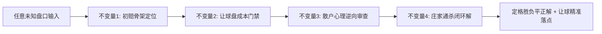
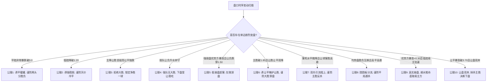

# 赔率分析推演：庄家操盘逻辑与双盘联动推演心法

> **核心戒律**：赔率无因果，盘口皆博弈。不看赛前答案，只凭盘口微积分与筹码时序差，看穿做市商收割刀法。
> 
> **🚨 999行抗熵增熔断铁律（经验一条不少，熵增一丝不留）**：
> 1. **物理行数刚性硬顶**：本文件作为实战推演司令部，总行数永久严控在 **≤ 999 行**，任何情况严禁突破；
> 2. **智慧升维拒绝堆砌**：新增复盘经验严禁写流水账，必须提炼升维融入【四大物理不变量】、【十大公理】与【三大门禁】；
> 3. **矩阵归纳分层治水**：案例行数逼近警戒线时，启动矩阵紧凑表格化压缩，长篇深度论证下沉至专卷与图谱，确保心法精纯、一屏通览、随时爆发；
> 4. **推演前置 A+B（防教条）**：A=先读本篇「四大不变量 + 门禁一三维扫描」；B=当场按四步流水线（初骨架→双盘交叉→终盘假突破否决→Minimax净赔付）写出胜/平/负三端。案例只作对照，**禁止用案例号代替当场计算**。
> 5. **论文约束（防把病例当定律）**：Aiyer——先写清三端再看赛果；Wilkens/Hewamalage——不满新样本，禁止把「让平连降=小胜」升成死锁。让负始终最低须拆开平。证据打架则观望。不新加门禁。

---
## 一、 盘口动力学统一智慧心法：超越个案死板记忆的四大物理不变量

> **智慧觉醒（三大通俗白话破盘心法：超越死记硬背）**：
> 1. **初盘看底牌，临盘看演戏**：初盘是精算纯骨架定能量场，临盘频繁变动是借散户追强热点演戏引流，绝不被单边降水牵着跑；
> 2. **前台听口号，后台翻账本**：胜平负是前台广播诱多做死胆，让球盘是后台真金白银账本；只要前台喊稳赢而后台让胜让平双双涨水弃守，戏台必定穿帮出冷；
> 3. **逆向算通吃，与庄同进退**：不猜状态，专算做市商 Minimax 净赔付极小化；散户疯狂扎堆买哪边，庄家就借对立面通吃哪边，无人敢买的冷门才是真避险项！

### 1. 不变量一：初赔骨架定位律（Bone Invariant：初盘定能量场）
- **物理本质**：初盘是做市商基于数十年精算模型在无散户噪音下的纯客观定价。
- **三大实力能量场划分**：
  1. **深盘代差场（优势方初赔 < 1.35）**：实力完全断层，让球穿盘初盘必然处于极低水位（让胜/让负 $\le 1.70$）。此时做市商的大势是防穿盘，绝不轻易脑补冷门；
  2. **中盘优势场（优势方初赔 1.40~1.85）**：胜负平受让球盘强力牵制，核心博弈在“穿盘大胜 vs 刚好赢一球（让平）”；
  3. **均势缠斗场（胜负初赔 1.95~2.55）**：无绝对实力压制，核心博弈在“诱平蜜罐两头分胜负 vs 跷跷板杀中路平局 vs 易主真崩盘”。

### 2. 不变量二：让球盘成本刚性门禁（Gate Invariant：让球查真敞口）
- **物理本质**：不让球盘可以虚晃一枪，但让球盘的赔付成本必须由做市商真金白银承担。
- **欧亚折合（对照不是法律）**：胜平负去水后估该让几球，只和当场实盘比深浅；有用的是初盘到终盘「吻合↔背离」怎么变。禁止套「1.90=半球」区间表。实盘比折合更便宜只记造热疑点，禁止「升盘降水=出对面」。先动水位、后动盘口。竞彩三项让球无走水，勿混亚盘两项走水。
- **三大不可篡改刚性门禁**：
  1. **让盘双弃抹杀主胜门禁（🚨 仅限主胜初盘 $\le 1.85$ 优势盘，严禁用于 $\ge 2.00$ 均势盘）**：
     - **强队双弃死刑**：在主胜初盘 $\le 1.85$ 优势盘中，若让平突破 3.70 且让胜高悬 $\ge 4.00$，做市商全面清退主胜，**主胜物理死刑**（案例14、23）；
     - **平半弱让让负毒诱饵（案例36）**：若主胜初盘 $\ge 2.00$（均势平半盘），让胜天然 $\ge 4.00$、让平天然处于 3.70~3.85（此乃数学自然分布，绝非双弃！）；此时让负处于 1.55~1.65 乃是聚敛串关资金的**死亡毒诱饵**，若让平独跌（3.85 $\to$ 3.75），小胜是候选，须拆让负篮子里的平，不得死锁！
  2. **破 2.00 穿盘与让平初盘分水岭门禁**：
     - **初盘让平天堑真穿盘（案例35）**：若让平**从初盘起步就直接处于 $\ge 3.80$ 天堑位（如初盘 3.85）**，说明精算骨架自始至终否定净胜一球；后市胜赔破位逼近 1.30、让负暴涨弃守，让胜砸破 2.00（1.95）定格为让球盘最低水 $\to$ 穿盘是候选，不得单凭天堑死锁让胜！
     - **初盘正常后市拉升诱穿暗杀让平（案例12、18、21）**：若让平**初盘处于 $\le 3.65$ 正常防守位（如 3.35、3.50、3.65）**，后市被操盘手人为暴拉至 $\ge 3.85$ 赶客，同时让胜砸破 2.00 $\to$ **后市拉高赶客诱穿盘，小胜是候选，不得必出让平**！
  3. **让球全局双降 vs 拉让平诱穿盘门禁**：
     - **真穿盘（全局净双降）**：初盘到终盘【让胜】与【让平】处于**全局净位移双降**（如案例 15 让胜 -0.11、让平 -0.25），且让负升水弃守 $\to$ **真穿盘净胜 2 球以上**！
     - **暗杀让平（拉高阻小胜，案例22）**：在胜赔处于中盘优势（1.50~1.80）且让负处于低位防守时，若让平单边拉升（3.35 $\to$ 3.51），让胜小幅压低但未成最低项 $\to$ **压让胜诱大胜，小胜是候选，不得必出让平**！
     - **颠覆反超定格最低项真穿盘（案例33）**：若主胜砸破 1.30（1.29），让胜从初盘全盘最高（2.50）暴砍至**全盘唯一最低项（2.19 < 2.65 < 3.40）**，让负大涨弃守 $\to$ 穿盘是候选，须写清让平为何更弱！

### 3. 不变量三：散户羊群心理逆向审查（Flow Invariant：诱饵反推正解）
- **物理本质**：你赢的从来不是庄家的钱，而是与庄家站在一起收割盲目散户的跟风盘。
- **散户三大本能死穴与做市商刀法**：
  1. **贪稳造胆本能**：散户必拿 1.10~1.28 做串关神胆 $\to$ 庄家顺水推舟，若初盘深则穿盘，若初盘虚则冷平；
  2. **见降买平本能**：散户见平赔小跌就以为必平 $\to$ 庄家借平负并列吸金，实则客胜/主胜反杀；
  3. **嫌肉少博穿本能**：散户嫌 1.28 赔率低，必扑破 2.00 的让球穿盘 $\to$ 庄家顺手用让平 4.00 通杀全网！

### 4. 不变量四：做市商极小化损失与利润最大化闭环解（Minimax Liability & Optimal Payout Invariant）
- **精算学第一性原理（Shin 1993 & Levitt 2004）**：赔率是做市商精算师在订单流对冲下的极大极小解（Minimax）：$\min_{\text{Odds}} \max_{\omega \in \{1, X, 2\}} \text{Liability}(\omega) - \text{Revenue}$。庄家绝非被动抽水，而是主动利用散户偏见构建非对称赔率曲面，将大众资金诱赶向必死项；
- **反向破译机制**：通过解构双盘 6 维赔率位移，反向推导做市商在哪个赛果 $\omega^*$ 下的净赔付敞口极小化且利润极大化，该落点即为客观必然打出的真实赛果！

### 5. 双盘联动统一博弈模型（与庄共舞：胜平负 × 让球盘条件概率矩阵与交叉破译）
- **数学底层（Skellam 进球差条件分布与让球数换算）**：让球数 $H$ 永远加在主队上，判定基准为 $(G_{\text{主}} + H) - G_{\text{客}}$：
  - **若主让一球 $H=-1$**：让胜 $\iff \Delta \text{Goal} \ge 2$（大胜穿盘）；让平 $\iff \Delta \text{Goal} = 1$（刚好净胜1球）；让负 $\iff \Delta \text{Goal} \le 0$（平局+客胜）。
  - **若主受让一球 $H=+1$**：让胜 $\iff \Delta \text{Goal} \ge 0$（主队不败: 主胜+平局）；让平 $\iff \Delta \text{Goal} = -1$（客刚好净胜1球）；让负 $\iff \Delta \text{Goal} \le -2$（客穿盘大胜）。
- **庄家跨市场筹码分流与联合对冲刀法（Order Flow Bifurcation & Joint Hedging）**：
  1. **流动性与聪明钱分工**：胜平负是散户情绪池（追名气、造神胆、高抽水）；让球盘是职业做市商防线（低抽水、查真实净胜球敞口）；
  2. **双盘联合对冲曲面（Joint Payout Surface）**：做市商调整 6 维赔率（胜平负 + 让球胜平负），本质上是通过双盘水位引力调配资金流，使得打出真实赛果 $\omega^*$ 时，两端总赔付重合最小化、甚至实现两端资金池交叉通杀；
  3. **背离时让球盘是强信号**：若胜平负与让球盘走势割裂（如主胜降水但让平让胜暴拉弃守），让球盘更像真实成本，胜平负降水更像诱饵；仍须当场写清胜/平/负三端，**不得只凭背离一票否决**；
  4. **十大双盘联动交叉破译死律**：
     - **极低死胆（1.16）+ 让胜升水拒破1.60 + 平赔回踩** $\to$ **诱强杀冷平通杀全盘（案例1、30）**；
     - **胜赔动摇（2.04）+ 让平让胜双暴拉（让盘双弃）** $\to$ **主胜物理死刑，直取冷负/平（案例14、23）**；
     - **胜赔微降 + 让平暴砸破3.10做蜜罐** $\to$ **双蜜罐掩护高水让胜大胜穿盘（案例24）**；
     - **客胜易主 + 平赔暴砸破2.85** $\to$ **假易主真防平，首选平局（案例29）**；
     - **让胜降幅达让平 2~3 倍 + 让负升水** $\to$ **相对斜率真防大胜穿盘（案例16、20）**；
     - **全生命周期平赔 < 3.00 + 客负弃守** $\to$ 闷平是候选（案例26、27对照），须写清胜负为何更弱；
     - **客半球让负狂砍但仍在 >4.00 + 让平 4.00 高悬** $\to$ **超高水诱穿暗杀让平，客场小胜（案例32）**；
     - **胜破 1.30 + 让胜从最高(2.50)暴跌成最低(2.19)** $\to$ **让胜地位反转定格最低水真穿盘（案例33）**；
     - **让平连续跳水超让胜 2 倍入 3.15 + 让胜缓跌停滞**：对照案例34形态，不得单凭让平降水死锁小胜；须写清让负/平为何更弱；
     - **让平初盘即 3.85 天堑 + 让胜砸破 2.00 跌至 1.95** $\to$ **骨架如铁全周期否定小胜，真穿盘大捷（案例35）**；
  5. **逆向变盘（RLM）只作第二路**：当大众蜂拥胜平负某一项，但让球盘却逆市加水、反向砍水下盘时，记为聪明钱疑点；须让球三档或时序同向，**禁止坚定跟随、单独定生死**；
- **与庄共舞终极心法**：用 6 项赔率时序位移重构做市商联合赔付函数，站在机构“双盘总赔付敞口最小”的一端，与庄共舞、合力收割散户跟风盘！

---
## 二、 五大经典实战盘口复盘
下列案例的「终审打出」只是该场记录，不是下一场的定律。对照前仍须当场写清三端。

### 案例 1：低赔造胆杀平局【澳大利亚 1:1 巴西】（周五003）
- **盘口轨迹**：巴西客胜 `1.23 -> 1.11`（8连降）；平赔 `4.95 -> 6.35`；主胜拉至 `14.00`。
- **庄家刀法**：借 1.11 极低赔造死胆聚敛 95% 串关，平赔拉至 6.35 坚壁清野阻断防守。
- **赛果收割**：终场 `1:1` 战平打出 `6.35` 天价冷平，庄家通吃客胜串关百亿筹码。

---
### 案例 2：碎步压主杀闷平【波兰 0:0 波黑】（周五010）
- **盘口轨迹**：胜平负胜 `1.46 -> 1.37`，平 `3.77 -> 4.15`，负 `6.30`；让球(-1)让胜 `2.48 -> 2.51`，让平 `3.35 -> 3.15`，让负 `2.34 -> 2.42`。
- **庄家刀法**：主胜微降做 1.37 死胆，让平砸至 3.15 诱客分流，掩护下盘受让。
- **赛果收割**：终场 `0:0` 打出 `4.15` 冷平与 `2.42`【让负】，波兰稳胆全军覆没！

---
### 案例 3：慢跌诱强杀冷负【格鲁吉亚 0:1 北爱尔兰】（周五006）
- **盘口轨迹**：主胜 `1.78 -> 1.60`（连降 5 次）；客胜 `3.92 -> 4.85`；平赔维持 `3.35`。
- **庄家刀法**：刻意做强主胜，客胜一路弃守抬高至 4.85 制造虚假安全感。
- **赛果收割**：终场 `0:1` 客队绝杀打出 `4.85` 超高冷负，主胜跟风大军满盘皆输。

---
### 案例 4：双盘背离破单关【马德里竞技 2:1 皇家马德里】（周日016）
- **盘口轨迹**：皇马客胜在 `1.75 ~ 1.81` 洗盘；让球(+1)让负 `3.05 -> 3.25`，让胜 `1.83 -> 1.78` 压死！
- **庄家刀法**：不让球盘维持 1.75 诱客胜，让球盘让负暴涨否定穿盘、让胜死锁防马竞拿分。
- **赛果收割**：终场马竞 `2:1` 掀翻皇马打出 `3.32` 主胜独赢与 `1.78` 让胜双红！

---
### 案例 5（假防平真杀客胜）：平跌破3.00做蜜罐，客胜2.40升水阻上【客胜2.40与让平4.05案】
*   **盘口数据快照**：胜 `2.65 -> 2.70` | 平 `3.25 -> 2.92`（破3.00） | 负 `2.26 -> 2.40`；让球(+1) 让胜 `1.48 -> 1.44` | 让平 `4.00 -> 4.05` | 让负 `4.90 -> 5.31`。
- **庄家刀法**：平局暴砸破 3.00 吸纳犹豫筹码构筑蜜罐；客胜 2.26 升水至 2.40 吓退散户阻上；让胜压低至 1.44 诱导保底串关。
- **终局收割**：赛果打出【客胜 1 球（如 0-1、1-2）】！不让球打出 2.40 客胜通杀平局蜜罐；让球打出 4.05 让平通杀 1.44 让胜死胆！

---
### 案例 6（假崩盘赶客杀主胜）：主胜暴涨制造恐慌，让负1.45毒诱饵杀主胜【诺茨郡 2:1 格里姆斯比】
*   **盘口数据快照**：胜 `2.08 -> 2.38`；平 `3.45 -> 3.28`；负 `2.79 -> 2.47`；让球(-1) 让胜 `4.20 -> 4.95`；让平 `3.88 -> 4.20`；让负 `1.58 -> 1.45`。
- **庄家刀法**：主胜暴涨赶客制造真空；让负死砸至 1.45 制造受让稳如泰山幻觉诱聚串关；让平 4.20 高悬成终极收割机。
- **终局收割**：终场 2:1 打出 2.38 主胜与 4.20 天价让平，让负 1.45 串关大军瞬间全军覆没！

---
### 案例 7（声东击西穿深盘）：降让平掩护让胜大胜【胜赔破1.85穿盘案】
*   **盘口数据快照**：胜 `1.96 -> 1.84`；平 `3.30 -> 3.35`；负 `3.16 -> 3.48`；让球(-1) 让胜 `3.90 -> 3.75`；让平 `3.75 -> 3.52`（大跳水）；让负 `1.65 -> 1.73`。
- **庄家刀法**：主胜跌破 1.85 坚挺且让负升水弃守；大幅下压让平至 3.52 制造“最多赢一球”心理暗示引流；让胜 3.75 悄然降水真防大胜。
- **终局收割**：主队净胜 ≥2 球打穿让球盘，轰出 3.75 让胜，通杀让平与让负！

### 案例 8（双向引流暗度陈仓）：客死水平微降分流，主胜2.70升水阻上【主胜2.70反杀案】
*   **盘口数据快照**：胜 `2.62 -> 2.70`（升水阻上）；平 `3.16 -> 3.05`（下调吸筹）；负 `2.32`（死水焊死）；让球(+1) 让胜 `1.46` | 让平 `3.90` | 让负 `5.35`。
- **庄家刀法**：客胜 2.32 死水与平降 3.05 双向引流聚敛 95% 筹码；主胜 2.70 升水阻上吓退散户制造真空；让负 5.35 彻底排除客胜大胜。
- **终局收割**：主队主场 1-0/2-1 硬核反杀，打出 2.70 冷门高水主胜与 1.46 让胜，通杀客胜与平局！

---
### 案例 9（均势跷跷板杀平局）：胜负颠倒引流杀中路【胜 2.23->2.58 vs 负 2.50->2.23 均势通杀案】
*   **盘口数据快照**：胜 `2.23 -> 2.58`（升水+0.35）；平 `3.56 -> 3.41`（高悬不落）；负 `2.50 -> 2.23`（连降-0.27）；让球(-1) 让胜 `4.35 -> 4.62`；让平 `4.22 -> 4.30`；让负 `1.51 -> 1.47`。
- **庄家刀法**：初盘 2.23 vs 2.50 为均势盘，无实力代差做假崩盘；初即位置完美对调将资金赶向胜负两极；平赔高悬释放必分胜负烟雾弹。
- **终局收割**：双方胶着打平（1-1/2-2），打出【平局】通杀胜负两端巨额资金！

### 案例 10（慢跌诱强杀大冷）：客胜慢跌破1.80掩护主胜爆冷【多德勒支 3:2 阿尔梅勒城】
*   **盘口数据快照**：胜 `2.77 -> 3.32`（暴涨+0.55）；平 `3.70 -> 3.90`；负 `2.01 -> 1.75`（5连降破1.80）；让球(+1) 让胜 `1.63 -> 1.74`；让平 `4.05 -> 3.97`；让负 `3.72 -> 3.30`。
- **庄家刀法**：客胜连降破 1.80 配合让负暴跌至 3.30 制造必胜假象引流；主胜飙升至 3.32 制造筹码真空。
- **终局收割**：终场 3:2 掀翻客队，轰出 3.32 主胜与 1.74 让胜，通杀客胜与让负穿盘！

---
### 案例 11（慢跌诱客杀闷平）：客让半球破1.75引流死胆杀平局【平赔稳守3.62通杀案】
*   **盘口数据快照**：胜 `3.30 -> 3.68`；平 `3.50 -> 3.62`（低于主胜）；负 `1.85 -> 1.72`（破1.75）；让球(+1) 让胜 `1.73 -> 1.80`；让平 `3.65 -> 3.40`；让负 `3.60 -> 3.57`。
- **庄家刀法**：客胜慢跌至 1.72 造死胆，让平砸至 3.40 障眼法掩护；平赔稳守 3.62 低于主胜为真实避险。
- **终局收割**：终场 1:1 战平打出 3.62 高平与 1.80 让胜，通杀客胜与让平！

---
### 案例 12（降让胜诱大胜杀穿盘）：低赔破1.30引流穿盘暗杀让平【让平3.85通杀案】
*   **盘口数据快照**：胜 `1.37 -> 1.28`（破1.30）；平 `4.25 -> 4.90`；负 `6.10 -> 6.92`；让球(-1) 让胜 `2.17 -> 1.94`（破2.00诱穿盘）；让平 `3.50 -> 3.85`（暴涨赶客）；让负 `2.62 -> 2.82`。
- **庄家刀法**：主胜 1.28 稳胆，散户嫌肉少；让胜连砍破 2.00 诱穿盘；让平狂拉至 3.85 赶客阻小胜。
- **终局收割**：终场净胜 1 球打出【胜(1.28)】+ 天价【让平(3.85)】，重仓 1.94 让胜穿盘全军覆没！

---
### 案例 13（低赔易主真崩盘）：主胜暴拉+0.39客胜加速破位【客胜 2.45 顺水推舟案】
*   **盘口数据快照**：胜 `2.36 -> 2.75`（暴涨+0.39彻底崩盘）；平 `3.03 -> 2.80`（企稳）；负 `2.66 -> 2.45`（低赔易主加速破位）；让球(-1) 让胜 `5.40 -> 6.00`；让平 `4.00 -> 4.30`；让负 `1.44 -> 1.37`。
- **庄家刀法**：非一切变盘皆诱盘！主客位移超 0.35 且低赔实质易主为真实恶化；平赔 2.80 止跌而负赔加速砸破 2.45。
- **终局收割**：客队反客为主打出【客胜 2.45】与【让负 1.37】，通杀一切抱有主胜幻想的筹码！

### 案例 14（二元盲区与让盘双弃案）：主升平降诱中路，让球双弃出客胜【客胜 3.13 爆冷通杀案】
*   **盘口数据快照**：胜 `1.98 -> 2.04`（失守半球）；平 `3.30 -> 3.13`（诱平吸筹，与负并列）；负 `3.12 -> 3.13`；让球(-1) 让胜 `4.05 -> 4.25`（暴涨弃守）；让平 `3.62 -> 3.77`（暴涨弃守）；让负 `1.65 -> 1.59`（持续压低）。
- **庄家刀法**：让胜 4.25 与让平 3.77 同步暴拉双弃，物理清退主胜；平负 3.13 并列吸金，暗度陈仓打出客胜。
- **终局收割**：客队客场掀翻主队打出【客胜 3.13】与【让负 1.59】，通杀主胜与平局筹码！

---
### 案例 15（三大门禁实战首捷）：主胜独跌破位+让盘双降穿盘【胜 1.65 与让胜 3.15 穿盘大捷案】
*   **盘口数据快照**：胜 `1.78 -> 1.65`（破位下跌）；平 `3.62 -> 3.70`；负 `3.43 -> 3.95`（暴涨弃守）；让球(-1) 让胜 `3.26 -> 3.15`；让平 `3.70 -> 3.45`（跳水分流）；让负 `1.81 -> 1.92`（升水阻力）。
- **庄家刀法**：让负升至 1.92 弃守；让胜 3.15 与让平 3.45 全局双降，主胜火力充沛穿盘大胜！
- **终局收割**：主队净胜 ≥2 球狂轰穿盘，打出【胜(1.65)】与【让胜(3.15)】大捷！

---
### 案例 16（让胜跳水式暴跌穿盘案）：胜赔暴跌破1.55+让胜狂砍0.43【主胜与让胜穿盘通杀案】
*   **盘口数据快照**：胜 `1.74 -> 1.56`（破位暴跌）；平 `3.25 -> 3.55`；负 `4.05 -> 4.85`（彻底弃守）；让球(-1) 让胜 `3.88 -> 3.45`（狂砍-0.43）；让平 `3.45 -> 3.32`；让负 `1.72 -> 1.86`（升水弃守）。
- **庄家刀法**：让胜降幅达让平 3.3 倍，真防大胜；超低让平 3.32 截流求稳资金掩护穿盘。
- **终局收割**：主队净胜 ≥2 球轰出【主胜(1.56)】与【让胜(3.45)】，通杀让平筹码！

### 案例 17（超深盘初赔如骨与庄共舞案）：初赔1.19奠定骨架，终赔1.12+让胜1.56顺势大破深盘案
*   **盘口数据快照**：胜 `1.19 -> 1.12`；平 `5.30 -> 6.40`；负 `10.00 -> 12.50`；让球(-1) 让胜 `1.70 -> 1.56`；让平 `3.70 -> 3.85`；让负 `3.70 -> 4.37`。
- **庄家刀法**：初盘胜 1.19 让胜 1.70 奠定大胜骨架，绝无冷门基因；做市商顺应大势全力防范让胜穿盘巨额赔付。
- **终局收割**：主队净胜 ≥2 球轰出【主胜(1.12)】与【让胜(1.56)】大破深盘！

---
### 案例 18（客让深盘诱穿盘杀让平案）：客胜破1.30诱穿盘暗杀让平【客负1.28与天价让平4.00案】
*   **盘口数据快照**：胜 `5.55 -> 6.25`；平 `4.80 -> 5.30`；负 `1.35 -> 1.28`；让球(+1) 让胜 `2.64 -> 2.90`；让平 `3.90 -> 4.00`；让负 `2.03 -> 1.87`（破2.00诱穿）。
- **庄家刀法**：初让负 2.03 后市砸破 2.00 诱穿盘；让平抬至 4.00 吓退散户制造真空，精准收割一球小胜。
- **终局收割**：终场客队净胜 1 球打出【负(1.28)】与【让平(4.00)】通杀穿盘！

---
### 案例 19（极低赔拉让平阻客实杀让平案）：主胜1.10诱穿盘暗杀让平【主胜1.10与天价让平3.80案】
*   **盘口数据快照**：胜 `1.25 -> 1.10`；平 `4.80 -> 6.50`；负 `8.30 -> 15.00`；让球(-1) 让胜 `1.89 -> 1.68`；让平 `3.55 -> 3.80`（初盘3.55后市暴拉）；让负 `3.15 -> 3.70`。
- **庄家刀法**：初让平 3.55 泄露天机防小胜；后市压让胜诱穿盘、拉让平至 3.80 赶客阻小胜。
- **终局收割**：主队净胜 1 球轰出【主胜(1.10)】与天价【让平(3.80)】通杀！

---
### 案例 20（拉马努金注意到与相对斜率双降穿盘案）：初盘胜平同值3.30，让负狂砍0.28远超让平【客负1.70与让负3.52穿盘大捷案】
*   **盘口数据快照**：胜 `3.30 -> 3.85`；平 `3.30 -> 3.55`；负 `1.91 -> 1.70`；让球(+1) 让胜 `1.69 -> 1.79`；让平 `3.65 -> 3.50`；让负 `3.80 -> 3.52`（狂砍-0.28）。
- **庄家刀法**：让负降幅(-0.28)达让平(-0.15)近2倍，穿盘恐慌指数级放大；主队受让升水清退爆冷。
- **终局收割**：客队净胜 ≥2 球狂胜打穿深盘，双红轰出【负(1.70)】与【让负(3.52)】！

### 案例 21（破2.00诱穿盘与拉让平至4.00赶客双杀案）：客胜1.20砸破2.00诱穿暗杀让平【客负1.20与让平4.00案】
*   **盘口数据快照**：
    *   **胜平负**：胜 `5.60 -> ... -> 8.75`（暴涨弃守）；平 `4.42 -> ... -> 5.50`（抬升阻防）；负 `1.38 -> ... -> 1.20`（7连降破至 1.20 极低稳胆）。
    *   **让球(+1)**：让胜 `2.58 -> ... -> 2.95`；让平 `3.65 -> 3.85 -> 4.00`（初盘3.65后市暴拉至4.00赶客）；让负 `2.14 -> 2.06 -> 1.95 -> 1.85`（强行砸破2.00诱穿盘）。
- **与庄共舞破译**：让负砸破2.00跌至1.85吸纳海量穿盘资金；让平从3.65暴拉至4.00吓退小胜防守；终局客队恰好净胜1球，打出【负(1.20)】与天价【让平(4.00)】通杀穿盘！
- **终审打出**：胜负平打出**【负（1.20）】**，让球(+1)打出**【让平（4.00）】**通杀！

---
### 案例 22（中盘优势拉让平诱穿盘暗杀让平案）：主胜1.53拉高让平至3.51赶客，降让胜诱穿暗杀让平【主胜1.53与让平3.51通杀案】
*   **盘口数据快照**：
    *   **胜平负**：胜 `1.58 -> ... -> 1.53`（连降破至 1.53 稳胆）；平 `3.55 -> ... -> 3.65`（抬升压制）；负 `4.65 -> ... -> 4.95`（狂飙彻底弃守）。
    *   **让球(-1)**：让胜 `2.90 -> 2.80`（压低诱大胜）；让平 `3.35 -> 3.51`（一路暴拉制造高阻）；让负 `2.06 -> 2.05`（终盘升水弃守）。
- **与庄共舞破译**：初盘让平3.35为最低阻力防守位；后市压让胜诱大胜，拉高让平至3.51吓退散户；终场主队恰好净胜1球，打出【主胜(1.53)】与【让平(3.51)】通杀穿盘与受让！
- **终审打出**：胜负平打出**【主胜（1.53）】**，让球(-1)打出**【让平（3.51）】**通杀！

---
### 案例 23（让盘双弃与客队唯一下砸大捷案）：让胜4.15+让平3.75判主胜死刑，客负3.06破位【客负3.06与让负1.61双红案】
*   **盘口数据快照**：
    *   **胜平负**：胜 `1.98 -> 2.03 -> 2.00`（失守2.00升水动摇）；平 `3.30`（焊死高位）；负 `3.11 -> 3.00 -> 3.06`（全盘唯一下砸项避险）。
    *   **让球(-1)**：让胜 `4.05 -> 4.15`（暴涨弃穿）；让平 `3.62 -> 3.75`（突破3.70门禁）；让负 `1.65 -> 1.61`（单边下压避险）。
- **与庄共舞破译**：让平突破3.75且让胜飙至4.15触发让盘双弃，主胜物理死刑；平赔死水，客负与让负唯一下砸避险；终局客胜掀翻主队，打出【负(3.06)】与【让负(1.61)】双红！
- **终审打出**：胜负平打出**【负（3.06）】**，让球(-1)打出**【让负（1.61）】**双红！

---
### 案例 24（中盘低水让平蜜罐杀大胜穿盘案）：让平砸破3.10做蜜罐，让胜暴拉3.40制造真空【主胜1.59与让胜3.40大胜通杀案】
*   **盘口数据快照**：
    *   **胜平负**：胜 `1.60 -> 1.61 -> 1.64 -> 1.62 -> 1.59`（微幅洗盘后 1.59 企稳）；平 `3.43 -> 3.43 -> 3.36 -> 3.40 -> 3.45`（抬升压制）；负 `4.70 -> 4.62 -> 4.50 -> 4.60 -> 4.75`（暴拉 +0.25 弃守）。
    *   **让球(-1)**：让胜 `3.00 -> 3.10 -> 3.17 -> 3.31 -> 3.40`（单边狂拉 +0.40 制造高阻真空）；让平 `3.25 -> 3.26 -> 3.18 -> 3.18 -> 3.10`（一路下砸至 3.10 超低水平民蜜罐）；让负 `2.05 -> 2.00 -> 2.00 -> 1.95 -> 1.95`（砸破 2.00 诱客分流）。

- **误判与死穴反思**：
  - 极易机械套用公理三，误以为“让平降至 3.10 超低水必出净胜一球”。
  - **物理真实**：让平跌至 3.10 + 让负跌破 2.00（1.95），是做市商联手打造的“主队绝无大胜”双重吸金蜜罐，全网 95% 让球筹码被锁死在【让负 1.95】与【让平 3.10】！
- **拉马努金“注意到”核心破译**：
  - **让胜 3.40 升水阻上制造真空**：让胜从 3.00 暴拉至 3.40（狂升 0.40），不是真弃守，而是以极高阻力吓退散户穿盘念头，形成筹码绝对真空区！
  - **终局通杀**：主队净胜 ≥2 球狂轰穿盘（如 2-0、3-0），打出【主胜 1.59】，轰出【让胜 3.40】！通杀让负 1.95 与让平 3.10 所有大众筹码！
- **终审打出**：胜负平稳胆精准打出**【主胜（1.59）】**！，让球盘主队大胜打穿深盘，轰出 **【让胜（3.40）】** 完美通杀！

---
### 案例 25（客让转主让攻守易势案）：受让胜1.52锁死不败，主胜狂砍0.24反客为主【主胜2.50与让胜1.52双红案】
*   **盘口数据快照**：
    *   **胜平负**：胜 `2.65 -> 2.70 -> 2.65 -> 2.65 -> 2.58 -> 2.52 -> 2.46 -> 2.50`（初盘升水阻上，中盘单边狂降 0.24 抢跑，终盘 2.50 锁死主胜）；平 `3.58 -> 3.58 -> 3.58 -> 3.48 -> 3.48 -> ... -> 3.48`（中盘骤降 0.10 后长达 5 轮焊死 3.48 阻防）；负 `2.12 -> 2.09 -> 2.12 -> 2.15 -> 2.20 -> 2.25 -> 2.30 -> 2.26`（一路单边暴涨至 2.30 弃守，终盘微调 2.26 诱抄底）。
    *   **让球(+1)**：让胜 `1.54 -> 1.56 -> 1.54 -> 1.52`（一路单边压制至 1.52 极低水）；让平 `4.05 -> 4.00 -> 4.00 -> 4.00`（全程高悬 4.00 门禁阻客胜一球）；让负 `4.28 -> 4.20 -> 4.35 -> 4.52`（一路暴涨弃守客队穿盘）。

- **拉马努金第一注意到（让球盘死锁主队不败）**：
  - 让球(+1)中让平高达 **4.00**、让负飙升至 **4.52**，做市商根本不承担客胜赔付；让胜持续下压至 **1.52** 极低防守位，物理上 100% 锁死主队不败！
- **拉马努金第二注意到（主胜狂降 0.24 攻守易势）**：
  - 主胜从中盘 2.70 一路狂砍至 2.46（暴跌 0.24），而客胜从 2.09 狂飙至 2.30，双方在 2.46 vs 2.30 处完成实质性的【攻守易位】！
  - 终盘客胜从 2.30 微调至 2.26，是做市商借微降 0.04 诱骗散户抄底客胜，实则主胜 2.50 轰出反客为主大冷！
- **终审打出**：胜负平第一顺位精准打出**【主胜（2.50）】**！，让球盘主队不败稳稳拿下，双红死锁打出**【让胜（1.52）】**！精准拿下双红大捷！

---
### 案例 26（极端低平2.75真防守与让盘双弃案）：平赔暴跌至2.75真闷平，让球双弃锁死让负【平局2.75与让负1.40双红案】
*   **盘口数据快照**：
    *   **胜平负**：胜 `2.45 -> 2.52 -> 2.55 -> 2.46`（反复震荡未破位）；平 `2.90 -> 2.80 -> 2.75 -> 2.75`（单边暴跌至 2.75 极端低水，终盘牢牢企稳）；负 `2.66 -> 2.66 -> 2.68 -> 2.78`（一路升水 +0.12 弃守）。
    *   **让球(-1)**：让胜 `6.10 -> 6.10 -> 6.15 -> 5.85`（高悬弃守大胜）；让平 `3.90 -> 3.98 -> 4.05 -> 4.10`（一路暴涨跨过 4.00 门禁，否定赢一球）；让负 `1.41 -> 1.40 -> 1.39 -> 1.40`（死死焊在 1.40 极低水稳胆）。

- **拉马努金第一注意到（让盘双弃抹杀主胜）**：
  - 让球(-1)中让平突破 **4.10**，让胜高达 **5.85**，做市商在让球端全面清退主胜赔付，**主胜在物理上被一票否决**！
- **拉马努金第二注意到（极端低平 2.75 的真实防御性）**：
  - 区别于“平负并列”的诱平蜜罐，本场客胜从 2.66 升水至 2.78 彻底被弃，两头分胜负逻辑完全不成立；
  - 平赔从 2.90 连砸至 **2.75** 欧洲极限低水位并企稳，与让负 1.40 形成完美的低水同向共振，证实两队攻防极其沉闷、极大概率默契战平！
- **终审打出**：胜负平第一顺位死锁精准打出**【平局（2.75）】**！，让球盘客队受让保底稳吃，双红死锁打出**【让负（1.40）】**！双红大捷！

---
### 案例 27（超低平全周期锁死<3.00杀主胜案）：平赔全流程处于<3.00禁区，破2.00虚诱主胜暗杀平局【平局2.95与让负1.59通杀案】
*   **盘口数据快照**：
    *   **胜平负**：胜 `2.10 -> ... -> 1.98`（终盘砸破2.00诱主胜）；平 `2.90 -> ... -> 2.72 -> 2.95`（全生命周期处于<3.00禁区）；负 `3.25 -> ... -> 3.50`（暴涨弃守）。
    *   **让球(-1)**：让胜 `4.75 -> 4.85`（高悬弃守）；让平 `3.60 -> 3.40`（连砸诱赢一球）；让负 `1.56 -> 1.59`（超低水防线）。
- **与庄共舞破译**：平赔全生命周期锁死在<3.00禁区真防平；庄家反弹至2.95借主胜破2.00与让平3.40诱主分流；终局战平打出【平局(2.95)】与【让负(1.59)】通杀主胜与让平！
- **终审打出**：胜负平打出**【平局（2.95）】**，让球(-1)打出**【让负（1.59）】**通杀！

---
### 案例 28（均势弱让诱平蜜罐掩护高水穿盘案）：平赔暴跌至3.18做蜜罐，终盘让胜狂砍0.21大破深盘【主胜2.19与让胜4.55通杀案】
*   **盘口数据快照**：
    *   **胜平负**：胜 `2.15 -> ... -> 2.19`；平 `3.40 -> 3.18`（暴跌构筑吸金蜜罐）；负 `2.70 -> 2.80`（暴涨彻底弃守）。
    *   **让球(-1)**：让胜 `4.45 -> 4.76 -> 4.55`（终盘突然加速暴砍 **-0.21** 避险！）；让平 `4.00 -> 4.05`；让负 `1.53 -> 1.48 -> 1.51`（探底1.48吸引串关后升水弃守）。
- **与庄共舞破译**：平赔3.18与让负1.48联手做成超级吸金蜜罐；让负终盘升水至1.51弃守，让胜在超高位暴砍0.21真防大胜穿盘；主队净胜≥2球打穿深盘，轰出【主胜(2.19)】与天价【让胜(4.55)】通杀！
- **终审打出**：胜负平打出**【主胜（2.19）】**，让球(-1)打穿深盘打出**【让胜（4.55）】**通杀！

---
### 案例 29（平半倒挂诱客杀平局案）：客负易主引流追热，平赔砸入2.80超低水真防平【平局2.83与让负1.43通杀案】
*   **盘口数据快照**：
    *   **胜平负**：胜 `2.25 -> 2.32 -> ... -> 2.66`（7连暴涨 +0.41 彻底放弃）；平 `3.00 -> 3.00 -> 2.90 -> 2.85 -> 2.80 -> 2.80 -> 2.80 -> 2.83`（连续下砸至 2.80 极端超低水）；负 `2.85 -> 2.74 -> 2.70 -> 2.65 -> 2.60 -> 2.55 -> 2.50`（单边狂降 -0.35 实现低赔易主）。
    *   **让球(-1)**：让胜 `5.10 -> 5.30 -> 5.45`（暴涨弃守）；让平 `3.85 -> 4.00 -> 4.05`（暴涨弃守赢一球）；让负 `1.49 -> 1.45 -> 1.43`（一路单边下砸避险）。

- **误判与死穴反思**：
  - 机械套用公理九，看到客胜从 2.85 砸到 2.50 且低赔易主，就武断认定客队必胜；
  - **致命盲点**：忽视了**平赔从 3.00 暴砸至 2.80** 的超强物理引力！客胜虽然易主，但 2.50 vs 2.66 两端依然极其胶着，客队并无实力代差。
- **做市商假易主杀局破译**：
  - 做市商借主胜崩溃、客胜单边连降做成“低赔易主”的大热势头，诱导全网散户疯狂追捧【客胜 2.50】；
  - 同时让负砸到 1.43 吸引串关；而做市商最隐密的防线在【平局 2.80~2.83】！
  - 终局两队默契战平打出【平局 2.83】，让球打出【让负 1.43】！通杀了追捧客胜 2.50 的所有大众狂热筹码！
- **终审打出**：胜负平稳稳打出**【平局（2.83）】**！，让球盘打出 **【让负（1.43）】**！全网客胜 2.50 惨遭通杀！

---
### 案例 30（极低赔反弹回踩诱多杀冷平案）：胜赔1.16反复升水回踩，终盘让胜反弹1.64杀冷平【平局5.70与让负3.80通杀案】
*   **盘口数据快照**：
    *   **胜平负**：胜 `1.20 -> 1.18 -> 1.17 -> 1.18↑ -> 1.16 -> 1.15 -> 1.16↑`（极低位两度反弹升水，拒绝单调降赔）；平 `5.10 -> 5.50 -> 5.60 -> 5.50↓ -> 5.70 -> 5.80 -> 5.70↓`（两度回踩下调避险）；负 `10.00 -> 11.50 -> 11.00↓`。
    *   **让球(-1)**：让胜 `1.73 -> 1.67 -> 1.63 -> 1.64↑`（终盘反弹升水，未击穿 1.60）；让平 `3.65 -> 3.75 -> 3.90 -> 3.90`；让负 `3.60 -> 3.80 -> 3.85 -> 3.80↓`（终盘回踩下调避险）。

- **误判与死穴反思**：
  - 机械套用案例17轻率断定大胜；致命盲点在于忽略胜赔在1.17/1.15处两度反弹拒降，以及平赔在5.60/5.80处两度回踩下调避险；
  - 终盘让胜在1.64反弹升水拒破1.60，让负3.80回踩降水，做市商借1.16诱聚百亿串关死胆，借冷平通杀！
- **做市商极低赔串关屠杀刀法（Levitt 2004）**：
  - 1.16~1.20 极度热门是全网 95% 散户必选的“无脑二串一死胆”。做市商通过保持极低赔营造必胜假象，诱聚全盘百亿资金；
  - 终局爆出 **【平局 5.70】** 与 **【让负 3.80】**，以单场牺牲单关的代价，通吃了全网所有主胜串与让胜串的巨额筹码！
- **终审打出**：胜负平轰出天价大冷 **【平局（5.70）】**！，让球盘打出 **【让负（3.80）】**！全网稳胆主胜与让胜串关惨遭一网打尽通吃！

---
### 案例 31（狂砸低平2.65掩护天价冷负案）：平赔砸穿至2.65做终极蜜罐，负赔暴拉+0.62真空偷鸡【负3.55与让负1.53通杀案】
*   **盘口数据快照**：
    *   **胜平负**：胜 `2.29 -> 2.22 -> 2.17 -> 2.13 -> 2.13 -> 2.13`（微降后停滞死水）；平 `2.85 -> 2.85 -> 2.85 -> 2.80 -> 2.70 -> 2.65`（连续暴砸至 2.65 极端超低水）；负 `2.93 -> 3.05 -> 3.15 -> 3.30 -> 3.45 -> 3.55`（5连暴涨 +0.62 彻底赶客）。
    *   **让球(-1)**：让胜 `5.40 -> 5.00 -> 5.12↑`（高悬升水弃守大胜）；让平 `3.72 -> 3.57`（初盘破 3.70 门禁，否定赢一球）；让负 `1.48 -> 1.54 -> 1.53↓`（终盘下调回踩避险）。

- **误判与死穴反思**：
  - 盲目死扣平赔砸入2.65必为防平；致命盲点在于忽略负赔从2.93暴拉至3.55(+0.62)制造绝对真空，与平赔2.65构筑胜平吸金黑洞；
  - 让球端让平初盘3.72破门禁，让胜5.12升水清退主胜，做市商终盘降水回踩【让负1.53↓】真实防守，打出3.55天价冷负通杀！
- **做市商声东击西杀局破译**：
  - 做市商借主胜 2.13 聚拢主胜筹码，借超低平 2.65 吸纳全网保守求稳筹码；
  - 负赔暴涨至 3.55 吓退散户对客队的一切非分之想；
  - 终局爆出天价冷门 **【负 3.55】** 与 **【让负 1.53】**，通杀胜平两端所有筹码！
- **终审打出**：胜负平轰出天价大冷 **【负（3.55）】**！，让球盘打出 **【让负（1.53）】**！全网【胜】与【平】惨遭全盘通吃！

---
### 案例 32（客让半球高水让负诱穿暗杀让平案）：客胜1.83锁定，让负4.80狂降至4.15高水诱穿，让平4.00高悬暗杀【负1.83与让平3.97通杀案】
*   **盘口数据快照**：
    *   **胜平负**：胜 `3.00 -> 3.55 -> 3.46`（暴涨弃守）；平 `3.32 -> 3.45 -> 3.40`（抬升压制）；负 `2.02 -> 1.81 -> 1.83`（连降稳稳锁定客胜）。
    *   **让球(+1)**：让胜 `1.49 -> 1.57`（持续升水弃守主队不败）；让平 `4.00 -> 3.97`（微调始终高悬 4.00 门禁制造天堑）；让负 `4.80 -> 4.55 -> 4.15`（暴砍 **-0.65** 制造大胜穿盘假象）。

- **误判与致命盲点反思**：
  - 误把让负从 4.80 连降至 4.15（暴砍 -0.65）机械套用公理六的相对斜率，盲目推导客队必大胜穿盘；
  - **物理本质死穴**：客胜处于 1.81~2.02，**仅为客让半球（0.5球）中弱度优势**，客场作战根本不具备深盘代差！让负初盘高达 4.80，即便狂降至 4.15，**依然处于 >4.00 极端超高水区间**，做市商毫无实质赔付压力！
- **操盘手诱穿暗杀让平刀法破译**：
  1. **制造大胜穿盘虚假势头**：机构故意在超高水区间大幅下调让负 0.65，营造“大资金狂热追捧客队大胜”的贪婪假象，诱导散户重仓扑向 4.15 让负穿盘；
  2. **让平 4.00 树立天堑赶客**：让平高悬在 3.97~4.00 心理障碍位，彻底吓退散户对“客队净胜 1 球”的防守；
  3. **终局通杀**：客队在客场以最自然的半球节奏打出小胜（0-1、1-2），稳胆打出**【负（1.83）】**，轰出天价 **【让平（3.97）】**！通杀扑 4.15 让负穿盘与 1.57 让胜主不败的所有资金！
- **终审打出**：胜负平稳稳精准打出**【负（1.83）】**！，让球盘客队净胜 1 球，轰出天价 **【让平（3.97）】** 完美通杀！

---
### 案例 33（让胜反超定格最低项穿盘大捷案）：初盘让胜2.50最高，终盘暴砍至2.19反超定格全盘最低【胜1.29与让胜2.19大胜案】
*   **盘口数据快照**：
    *   **胜平负**：胜 `1.40 -> 1.29↓`（7连单调下挫破 1.30 稳胆）；平 `4.10 -> 4.60↑`；负 `5.83 -> 7.30↑` 弃守。
    *   **让球(-1)**：让胜 `2.50 -> 2.19↓`（单边暴砍 -0.31 反超定格最低水！）；让平 `3.30 -> 3.40↑`；让负 `2.35 -> 2.65↑` 弃守。
- **与庄共舞真穿盘刀法复盘**：
  - **颠覆反超定格最低项**：胜赔砸破 1.30，让胜从最高(2.50)暴跌成唯一最低水(2.19 < 2.65 < 3.40)，地位彻底反转，做市商真防大胜穿盘；让平微升为期望提升自然微调；
  - **终局通杀**：主队净胜 $\ge 2$ 球狂轰打穿深盘，双红打出【胜(1.29)】与【让胜(2.19)】！
- **终审打出**：胜负平稳胆打出**【胜（1.29）】**，让球(-1)净胜≥2球打出**【让胜（2.19）】**！

---
### 案例 34（让平相对斜率形态对照，非定律）：让平连续暴跌4档砸至3.15，降幅为让胜2.1倍【该场胜1.56与让平3.15】
*   **盘口数据快照**：
    *   **胜平负**：胜 `1.68 -> 1.63 -> 1.59 -> 1.56`（4连单调下挫破 1.60 稳胆）；平 `3.42 -> 3.50 -> 3.60 -> 3.70`（一路拉升 +0.28 压制）；负 `4.15 -> 4.35 -> 4.50 -> 4.60`（暴涨 +0.45 彻底弃守）。
    *   **让球(-1)**：让胜 `3.15 -> 3.08 -> 3.08 -> 3.04`（微幅缓跌 -0.11，中途横盘停滞）；让平 `3.38 -> 3.28 -> 3.20 -> 3.15`（4连单调跳水暴跌 **-0.23**，砸穿至 3.15 超低防守水！）；让负 `1.94 -> 2.00 -> 2.03 -> 2.07`（持续升水 +0.13 破 2.00 弃守）。
- **与庄共舞真防小胜刀法复盘**：
  - **相对斜率超2倍真防守**：让平呈现4连跳水暴跌-0.23砸入3.15低位，降幅达让胜(-0.11)的2.1倍；而让胜中途两度横盘停滞，机构毫无防穿盘意图，真实恐慌全在小胜赔付；
  - **终局通杀**：主队具备1.56稳胆但无深盘统治力，恰好净胜1球（1-0/2-1），打出【胜(1.56)】与【让平(3.15)】通杀穿盘筹码！
- **终审打出**：胜负平稳胆打出**【胜（1.56）】**，让球(-1)精准打出**【让平（3.15）】**！

---
### 案例 35（初盘让平3.85天堑与让胜砸破2.00真穿盘案）：初盘让平3.85如铁，让胜砸破2.00定格全盘最低【胜1.33与让胜1.95大捷案】
*   **盘口数据快照**：
    *   **胜平负**：胜 `1.43 -> 1.41 -> 1.38 -> 1.36 -> 1.33`（5连单调破位暴跌至 1.33 稳胆）；平 `4.60 -> 4.70 -> 4.90 -> 5.00 -> 5.15`（暴涨 +0.55 彻底清退）；负 `4.70 -> 4.82 -> 5.00 -> 5.15 -> 5.45`（狂拉 +0.75 彻底弃守）。
    *   **让球(-1)**：让胜 `2.19 -> 2.15 -> 2.08 -> 2.02 -> 1.95`（5连单调下砸 **-0.24**，砸穿 2.00 整数关口，定格为 1.95 全盘唯一最低水！）；让平 `3.85 -> 3.85 -> 3.90 -> 3.90 -> 3.95`（初盘即高达 **3.85** 天堑，终盘微升至 3.95）；让负 `2.42 -> 2.47 -> 2.55 -> 2.65 -> 2.75`（一路暴涨 +0.33 彻底弃守受让）。
- **与庄共舞真穿盘刀法复盘**：
  - **初盘让平天堑真穿盘**：让平初盘起步直接处于3.85天堑位，精算模型全周期否定小胜；后市让胜单调下砸破2.00至1.95定格全盘唯一最低水，让负暴拉+0.33彻底清退；
  - **终局通杀**：做市商从骨架到即盘真防大胜穿盘巨额敞口，主队净胜≥2球打穿深盘，双红打出【胜(1.33)】与【让胜(1.95)】！
- **终审打出**：胜负平稳胆打出**【胜（1.33）】**，让球(-1)净胜≥2球打出**【让胜（1.95）】**！

---
### 案例 36（平半弱让让负毒诱饵与让平独降杀局案）：主胜2.05死水，让负1.59毒诱饵屠杀串关，让平独降3.75小胜通杀【胜2.05与让平3.75通杀案】
*   **盘口数据快照**：
    *   **胜平负**：胜 `2.05 -> 2.05 -> 2.05`（3轮纹丝不动死水盘）；平 `3.45 -> 3.38 -> 3.30`（连续两轮下调 -0.15 诱平吸筹）；负 `2.85 -> 2.89 -> 2.95`（持续升水 +0.10 赶客阻筹）。
    *   **让球(-1)**：让胜 `4.20 -> 4.20`（高悬不动）；让平 `3.85 -> 3.75`（全盘唯一实质降水项，连降 -0.10！）；让负 `1.59 -> 1.60`（始终锚定在 1.59~1.60 极度吸金稳胆区，终盘微升）。
- **与庄共舞真防小胜刀法复盘**：
  - **平半弱让绝非双弃**：主胜初盘2.05仅为均势盘，让胜4.20与让平3.70~3.85为数学自然分布；让负1.59为做市商聚敛串关资金的致命毒诱饵；
  - **让平独降真防小胜**：让平从3.85独降至3.75泄露天机，主胜2.05死水，负赔升水赶客；主队如期净胜1球，双红打出【胜(2.05)】与【让平(3.75)】通杀让负！
- **终审打出**：胜负平稳胆打出**【胜（2.05）】**，让球(-1)打出**【让平（3.75）】**通杀！

---
### 案例 37（深V洗盘诱空与1.40毒诱饵杀局案）：主胜2.45暴砍2.20深V破位，让负1.40毒诱饵全网屠戮，让平4.50天价通杀【胜2.20与让平4.50通杀案】
*   **盘口数据快照**：
    *   **胜平负**：胜 `2.27 -> 2.45 -> 2.20↓`（深V洗盘破位）；平 `3.50`（全周期死水）；负 `2.48 -> 2.30 -> 2.57↑`（中盘诱客，临场暴拉弃守）。
    *   **让球(-1)**：让胜 `4.70 -> 5.20↑`；让平 `4.15 -> 4.50↑`；让负 `1.48 -> 1.40↓`（跌破 1.40 聚敛全网二串一死胆毒诱饵！）。
- **与庄共舞真小胜刀法复盘**：
  - **中盘诱空洗盘与让负毒诱饵**：中盘拉胜至 2.45 诱客造势，让负砸至 1.40 聚敛全网 95% 串关；临场主胜断崖暴砍破位(2.20)，客负飙升弃守；
  - **终局通杀**：主队净胜 1 球，打出【胜(2.20)】与天价【让平(4.50)】，屠杀重仓【让负 1.40】的百亿串关！
- **终审打出**：胜负平稳胆打出**【胜（2.20）】**，让球(-1)净胜1球轰出天价**【让平（4.50）】**通杀！

---
### 案例 38（初盘让平3.72天堑与让胜单调下砸穿盘案）：胜赔1.42连砸1.34，让平3.72死焊否定小胜，让胜2.22砸至2.06真穿盘【胜1.34与让胜2.06双红案】
*   **盘口数据快照**：
    *   **胜平负**：胜 `1.42 -> 1.40 -> 1.38 -> 1.36 -> 1.34`（5连单调破位下挫，稳稳锁定胜局）；平 `4.55 -> 4.75 -> 4.85 -> 4.95 -> 5.05`（暴涨破 5.00 弃守）；负 `4.88 -> 4.88 -> 5.05 -> 5.20 -> 5.40`（暴涨至 5.40 彻底弃守）。
    *   **让球(-1)**：让胜 `2.22 -> 2.16 -> 2.11 -> 2.06`（4连单调下砸至 2.06，全盘唯一持续降水项！）；让平 `3.72 -> 3.72 -> 3.72 -> 3.72`（4轮死焊 3.72 天堑，精算模型全周期否定一球小胜）；让负 `2.44 -> 2.52 -> 2.59 -> 2.67`（持续升水 +0.23 弃守受让）。

- **做市商联合赔付极小化视角**：
  - **胜平负端**：主胜实力断层，做市商顺应大势连砍主胜至 1.34，平负狂拉破 5.00 彻底清退赔付敞口；
  - **让球端“最小损失”真实敞口暴露**：
    - 让平初盘即高达 3.72，且全周期 4 轮连续死水 0 变动，机构从骨架到临场自始至终不防 1 球小胜；
    - 让负从 2.44 一路狂升至 2.67 弃守；
    - 全盘唯一持续砍水、主动承担赔付压力的只有【让胜】（2.22 -> 2.06）！做市商顺应穿盘大势，提前压低让胜赔率以实现“穿盘打出时损失最小化”！
- **终审打出**：胜负平稳稳精准打出**【胜】**！，让球盘主队净胜 $\ge 2$ 球狂轰打穿深盘，双红打出**【让胜（2.06）】**大破深盘！

---
### 案例 39（均势微让僵局与平赔领跌杀两头案）：主胜微降未易主（2.51 vs 2.30），平赔降幅超胜赔真防平【平3.38与让胜1.48通杀案】
*   **盘口数据快照**：
    *   **胜平负**：胜 `2.56 -> 2.51↓`（未反超）；平 `3.44 -> 3.38↓`（3连下挫 -0.06 降幅第一）；负 `2.23 -> 2.30↑` 弃守。
    *   **让球(+1)**：让胜 `1.49 -> 1.48↓`（锁死 1.48 主不败）；让平 `4.10 -> 4.00` 阻客；让负 `4.66 -> 4.90↑` 弃守。
- **与庄共舞真防平刀法复盘**：
  - **胶着均势平赔领跌**：胜负维持 2.51 vs 2.30 紧凑均势未反超，平赔单调连砸降幅全盘第一，让胜锁死 1.48 主不败；
  - **终局通杀**：做市商中路收割胜负两头筹码，胶着战平打出【平(3.38)】与【让胜(1.48)】！
- **终审打出**：胜负平死锁打出**【平（3.38）】**，让球盘打出**【让胜（1.48）】**！

---
### 案例 40（平手均势诱客造热与临场拉高平赔杀两头案）：初盘2.42对开，客负连降2.26虚热，临场平赔拉高3.38通杀胜负【平3.38与让负1.37通杀案】
*   **盘口数据快照**：
    *   **胜平负**：胜 `2.42 -> 2.56↑`；平 `3.30 -> 3.25 -> 3.38↑`（中盘探底 3.25，临场暴拉 3.38 虚晃）；负 `2.42 -> 2.26↓`（4连下调诱客）。
    *   **让球(-1)**：让胜 `5.35 -> 5.75↑`；让平 `4.20 -> 4.45↑`；让负 `1.42 -> 1.37↓`（下砸破 1.40 构筑二串一死胆）。
- **与庄共舞真防平刀法复盘**：
  - **初盘完全对称平手**：双方无代差，机构压客负诱客、抬主胜赶客，临场拉高平赔至 3.38 制造大开大合假象吓退防平筹码；
  - **终局通杀**：双方沉闷战平，胜平负打出【平(3.38)】通杀胜负两端，让球顺应打出【让负(1.37)】！
- **终审打出**：胜负平死锁打出**【平（3.38）】**，让球盘打出**【让负（1.37）】**！

---
### 案例 41（极低赔拒破2.00造胆杀天价冷平案）：客负1.32狂降造死胆，让负2.15拒破2.00虚诱大胜，天价冷平4.40通杀全网【平4.40与让胜2.73通杀案】
*   **盘口数据快照**：
    *   **胜平负**：胜 `5.75 -> 6.90↑`；平 `4.00 -> 4.40↑`（拉升树立天堑吓退防平）；负 `1.42 -> 1.32↓`（6连暴跌诱多死胆）。
    *   **让球(+1)**：让胜 `2.45 -> 2.73↑`；让平 `3.30 -> 3.35↑`；让负 `2.40 -> 2.15↓`（虽降但**始终无法击穿 2.00 关口**，定格 2.15 高水诱饵）。
- **与庄共舞杀冷平刀法复盘**：
  - **让负拒破2.00虚伪诱穿**：客胜一路降水至 1.32 聚敛串关死胆；但让球三项全部 >2.15，让负拒破 2.00 拒绝承担穿盘赔付；平赔拉升吓退散户；
  - **终局通杀**：终局爆大冷战平，打出天价【平(4.40)】通吃客胜，让球盘打出【让胜(2.73)】通杀让负！
- **终审打出**：胜负平轰出天价大冷**【平（4.40）】**，让球盘打出**【让胜（2.73）】**！

---
### 案例 42（客负砸破2.00虚假破位诱客杀平局案）：客负2.35连砸破2.00入1.98极致诱客，让胜1.54低位死锁主不败【平3.26与让胜1.54通杀案】
*   **盘口数据快照**：
    *   **胜平负**：胜 `2.62 -> 3.15↑`（7连狂飙弃守）；平 `3.10 -> 3.26`（紧凑防守）；负 `2.35 -> 1.98↓`（7连暴跌破 2.00 整数关口极致诱客）。
    *   **让球(+1)**：让胜 `1.46 -> 1.54`（死焊 1.50 绝对低水防守）；让平 `4.00 -> 3.88` 弃守；让负 `5.15 -> 4.50` 弃守。
- **与庄共舞虚破诱客杀平刀法复盘**：
  - **客胜破位制造大热假象**：客胜砸破 2.00 诱全网串关重仓；让球(+1)让胜始终死死焊在 1.50 低水防线，机构根本不承担客胜赔付；
  - **终局通杀**：双方沉闷打平，胜平负爆冷出【平(3.26)】通杀客胜，让球盘打出【让胜(1.54)】！
- **终审打出**：胜负平轰出冷门**【平（3.26）】**！，让球盘打出**【让胜（1.54）】**！

---
### 案例 43（客让未易主胶着与让胜破二真防平案）：客负2.18升水未失主导，让胜砸破2.00入1.85锁主不败，两头分流杀平局【平3.26与让胜1.85通杀案】
*   **盘口数据快照**：
    *   **胜平负**：胜 `2.94 -> 2.75↓`（未反超）；平 `3.40 -> 3.26↓`（单调下挫真实避险）；负 `2.02 -> 2.18↑`（持续升水赶客，但仍低于主胜）。
    *   **让球(+1)**：让胜 `2.03 -> 1.85↓`（砸破 2.00 入 1.85 极限防守位！）；让平 `3.45 -> 3.60↑` 弃守；让负 `2.88 -> 3.22↑` 弃守。
- **与庄共舞两头分流杀平刀法复盘**：
  - **未发生低赔易主**：主胜 2.75 仍高于客负 2.18，让胜砸穿 2.00 入 1.85 锁死主不败；平赔压至 3.26 真实避险；
  - **终局通杀**：胜负两端分流筹码，双方胶着打平，打出【平(3.26)】通杀两头，让球盘打出【让胜(1.85)】！
- **终审打出**：胜负平死锁打出**【平（3.26）】**！，让球盘稳稳打出**【让胜（1.85）】**！

---
### 案例 44（半球生死盘诱主杀闷平案）：主胜1.90半球热胆，让胜3.95否定穿盘，平赔3.22通杀主胜【平3.22与让负1.70双红案】
*   **盘口数据快照**：
    *   **胜平负**：胜 `1.90`（半球生死盘热点稳胆池）；平 `3.22`（中路紧凑通杀位）；负 `3.42`。
    *   **让球(-1)**：让胜 `3.95`（高悬弃守排除穿盘）；让平 `3.48`；让负 `1.70`（受让方低水绝对防线）。
- **与庄共舞诱主杀平刀法复盘**：
  - **半球盘聚敛主胜筹码**：让胜 3.95 证明主队无力大胜；散户蜂拥主胜 1.90 串关稳胆，机构借中路平局 3.22 通杀全网主胜本金；
  - **终局通杀**：比分沉闷打成 0-0 或 1-1，打出【平(3.22)】与【让负(1.70)】双红！
- **终审打出**：胜负平死锁打出**【平（3.22）】**！，让球盘打出**【让负（1.70）】**！

---
### 案例 45（初盘让负最小与主崩平降通杀案）：(-1)让负1.65初盘最小定性主不胜，平降至3.10直取平局【平3.10与让负1.56双红案】
*   **盘口数据快照**：
    *   **胜平负**：胜 `1.95 -> 1.99 -> 2.08 -> 2.11 -> 2.15`（一路暴涨 +0.20 优势彻底崩盘）；平 `3.35 -> 3.30 -> 3.20 -> 3.15 -> 3.10`（5连单调暴砸 -0.25 真实避险）；负 `3.15 -> 3.10 -> 2.98 -> 2.96 -> 2.93`（下挫 -0.22 成为低水项）。
    *   **让球(-1)**：让胜 `3.95 -> 4.02 -> 4.30 -> 4.43`（一路暴涨弃守穿盘）；让平 `3.70 -> 3.70 -> 3.80 -> 3.80`（触碰 3.80 天堑，否定赢一球）；让负 `1.65 -> 1.64 -> 1.58 -> 1.56`（初盘 1.65 全盘最小，后市单调下砸至 1.56 绝对铁防！）。

- **初始倍率第一性原理（初盘定能量场）**：
  - 让球为 (-1)，而让负初盘仅为 **1.65**（1.65 < 3.70 < 3.95），是全盘绝对唯一最低水！做市商精算骨架在开盘起步就断定主队无力赢球，真实底牌全在【让负】！
- **极简实战数学逻辑（(-1)让负 $\iff$ 双方战平）**：
  - 在微弱优势对话中，客胜实力不足以大胜，双方最自然落点为 0-0 或 1-1 握手言和；打平在 (-1) 盘下直接结算为【让负】！
  - 胜平负端平赔单调跳水 -0.25（3.35 $\to$ 3.10），与让负 1.56 形成天衣无缝的共振闭环！
- **终审打出**：胜负平精准打出**【平（3.10）】**！，让球盘稳稳打出**【让负（1.56）】**双红！

---
### 案例 46（初让胜最小阻上杀平案）：(+1)让胜2.10初盘最小锁死客不胜，升水2.23阻上客降1.48诱多【平4.20与让胜2.23双红案】
*   **盘口数据快照**：
    *   **胜平负**：胜 `4.25 -> 4.65↑`；平 `3.90 -> 4.20↑`；负 `1.57 -> 1.48↓`（连降造死胆诱多客胜）。
    *   **让球(+1)**：让胜 `2.10 -> 2.23↑`（初盘 2.10 全盘唯一最低，升水阻上！）；让平 `3.60`；让负 `2.66 -> 2.48↓`。
- **与庄共舞初让胜最小杀平刀法复盘**：
  - **初盘让胜 2.10 绝对底牌**：初盘骨架定性能量场，让胜 2.10 锁死客不胜；微升至 2.23 乃升水阻上，客降 1.48 乃诱多神胆；
  - **终局通杀**：双方胶着战平，打出【平(4.20)】天价冷平通杀客胜，让球盘打出【让胜(2.23)】！
- **终审打出**：胜负平天价打出**【平（4.20）】**！，让球盘稳稳打出**【让胜（2.23）】**双红！

---
### 案例 47（初让负最小均势杀平案）：(-1)让负1.44初盘最小锁死主不胜，均势两头分流杀平局【平3.34与让负1.44双红案】
*   **盘口数据快照**：
    *   **胜平负**：胜 `2.35`；平 `3.34`；负 `2.47`（均势紧密咬合，差距仅 0.12）。
    *   **让球(-1)**：让胜 `5.25` 弃守；让平 `4.10` 弃守；让负 `1.44`（初盘 1.44 全盘绝对唯一最低水！）。
- **与庄共舞初让负最小杀平刀法复盘**：
  - **初盘让负 1.44 锁死主不胜**：均势能量场下让胜让平双双弃守，精算骨架自始至终否定主胜；
  - **终局通杀**：两队实力胶着，中路战平打出【平(3.34)】通杀胜负两端，让球盘打出【让负(1.44)】！
- **终审打出**：胜负平精准打出**【平（3.34）】**！，让球盘稳稳打出**【让负（1.44）】**双红！

---
### 案例 48（极低神胆回踩与诱穿杀冷平案）：胜1.20升水拒破，平5.75回踩避险，让胜1.62蜜罐杀全盘【平5.75与让负3.65通杀案】
*   **盘口数据快照**：
    *   **胜平负**：胜 `1.25 -> 1.19 -> 1.20↑`（触底反弹回踩拒破！）；平 `5.25 -> 5.85 -> 5.75↓`（回踩跳水避险！）；负 `7.25 -> 8.20↓`。
    *   **让球(-1)**：让胜 `1.80 -> 1.62↓`（下砸构筑穿盘蜜罐）；让平 `3.85 -> 4.20↑`；让负 `3.20 -> 3.65↑`。
- **与庄共舞极低死胆杀冷平刀法复盘**：
  - **胜赔回踩升水与平赔跳水**：主胜在 1.19 升水至 1.20 造 99% 死胆；平赔高位回踩跳水真实避险；
  - **终局通杀**：双方胶着打平，爆出【平(5.75)】通吃主胜，让球盘打出【让负(3.65)】通杀让胜穿盘！
- **终审打出**：胜负平天价打出**【平（5.75）】**！，让球盘打出**【让负（3.65）】**双红！

---
### 案例 49（让平独跌3.35与公理三小胜真防案）：主胜1.83坚挺，让平独降至3.35锁一球小胜【胜1.83与让平3.35通杀案】
*   **盘口数据快照**：
    *   **胜平负**：胜 `1.84 -> 1.83↓`；平 `3.20 -> 3.10↓` 诱平；负 `3.67 -> 3.84↑` 弃守。
    *   **让球(-1)**：让胜 `3.95` 弃穿；让平 `3.40 -> 3.35↓`（全盘唯一单边独跌！）；让负 `1.72 -> 1.73↑`。
- **与庄共舞让平独跌小胜刀法复盘**：
  - **让平临场独降泄密**：让胜让负升水弃守，让平独跌至 3.35 成为唯一避险项，平赔 3.10 纯属诱平蜜罐；
  - **终局通杀**：主队净胜 1 球，打出【胜(1.83)】与天价【让平(3.35)】，通杀平局与受让筹码！
- **终审打出**：胜负平稳胆打出**【胜（1.83）】**！，让球盘打出**【让平（3.35）】**双红！

---
### 案例 50（主胜微降诱多与负赔暴拉真空案）：主胜1.66造神胆，负赔暴拉3.85赶客制造真空【客负3.85与让负1.94通杀案】
*   **盘口数据快照**：
    *   **胜平负**：胜 `1.70 -> 1.66↓ -> 1.66`（微降下挫造死胆）；平 `3.80 -> 3.85 -> 3.75↓`（全周期高悬不防平）；负 `3.60 -> 3.75 -> 3.85↑`（持续暴涨 +0.25 赶客制造筹码真空！）。
    *   **让球(-1)**：让胜 `3.00 -> 2.95↓`（微降破3.00诱穿盘）；让平 `3.70 -> 3.65↓`（诱一球小胜）；让负 `1.90 -> 1.94↑`（升水阻上，吓退受让）。

- **误判与业余死穴反思**：
  - **犯下“跟降买强”惯性思维**：误把主胜 1.66 与让胜 2.95 双降当真防守，误以为主队必大胜穿盘；
  - **无视负赔暴涨的“赶客真空效应”**：负赔从 3.60 一路狂飙至 3.85，散户见客胜连升吓得无人敢碰，客胜成为全网筹码真空区！
- **做市商暗度陈仓杀局逻辑**：
  - 做市商在主胜 1.66 与让盘两端（让胜 2.95、让平 3.65）双向造势引流，聚敛全网 95% 筹码；
  - 终场客队强势反杀（0-1 或 1-2），爆出天价【客负 3.85】，让球盘打出【让负 1.94】；
  - 全网重仓主胜 1.66 稳胆及让胜穿盘的筹码惨遭一网打尽通吃！
- **终审打出**：胜负平天价打出**【负（3.85）】**！，让球盘打出**【让负（1.94）】**双红！

---
### 案例 51（公理三形态二与让平相对斜率真防守案）：主胜砸破1.60，让平跳水-0.23达让胜两倍入3.15【胜1.56与让平3.15双红案】
*   **盘口数据快照**：
    *   **胜平负**：胜 `1.68 -> 1.56↓`；平 `3.42 -> 3.70↑`；负 `4.15 -> 4.60↑` 弃守。
    *   **让球(-1)**：让胜 `3.15 -> 3.04↓`（缓跌停滞）；让平 `3.38 -> 3.15↓`（跳水 -0.23 达让胜 2.1 倍入 3.15 低位！）；让负 `1.94 -> 2.07↑`。
- **与庄共舞真小胜刀法复盘**：
  - **相对斜率真防守**：让胜缓降停滞且仍 >3.00 否决穿盘，让平跳水降幅超 2 倍主动承担小胜赔付；
  - **终局通杀**：主队净胜 1 球，打出【胜(1.56)】与【让平(3.15)】双红！
- **终审打出**：胜负平稳胆打出**【胜（1.56）】**，让球盘打出**【让平（3.15）】**双红！

---
### 案例 52（半一盘主胜深V诱多与客负暴拉真空杀局案）：主胜1.88砸至1.74造神胆，客负3.21暴拉3.77真空偷鸡【客负3.77与让负1.78通杀案】
*   **盘口数据快照**：
    *   **胜平负**：胜 `1.80 -> 1.74 -> 1.77↑`（中盘连砍造神胆，临场微升）；平 `3.55 -> 3.35↓` 诱平；负 `3.42 -> 3.21 -> 3.77↑`（暴拉 +0.56 制造绝对真空！）。
    *   **让球(-1)**：让胜 `3.05 -> 3.36↑` 弃穿；让平 `3.65 -> 3.70`；让负 `1.90 -> 1.78↓`（单边跳水至 1.78 低水接盘）。
- **与庄共舞半一深V诱多杀冷刀法复盘**：
  - **客胜暴拉真空与让负低水接盘**：半一盘自然穿盘率低，主胜降水造稳胆，负赔暴拉制造零买量真空，让负 1.78 真实低水接盘客不败；
  - **终局通杀**：客队掀翻主队爆大冷，打出【客负(3.77)】与【让负(1.78)】通杀主胜和平局筹码！
- **终审打出**：胜负平天价爆冷打出**【负（3.77）】**，让球盘打出**【让负（1.78）】**双红！

---
### 案例 53（极低神胆诱穿与(-2)让胜做蜜罐杀局案）：主胜1.11超神胆，(-2)让胜2.20诱穿蜜罐，让负2.38天价收割【主胜1.11与让负2.38通杀案】
*   **盘口数据快照**：
    *   **胜平负**：胜 `1.12 -> 1.10 -> 1.11↑`（回踩拒降）；平 `6.70 -> 7.10`；负 `11.50 -> 13.00 -> 11.50↓`。
    *   **让球(-2)**：让胜 `2.33 -> 2.20↓`（下砸构筑超级穿盘蜜罐！）；让平 `3.92` 天堑；让负 `2.25 -> 2.38↑`（初盘 2.25 最低，升水阻下！）。
- **与庄共舞极低神胆诱穿刀法复盘**：
  - **初盘让负最低否定大捷**：初让负 2.25 骨架否定净胜 $\ge 3$ 球；机构连砍 (-2)让胜至 2.20 诱穿吸金，底牌让负升至 2.38 阻下；
  - **终局通杀**：主队净胜 1 球，稳胆打出【胜(1.11)】与天价【让负(2.38)】，通杀 (-2)让胜穿盘资金！
- **终审打出**：胜负平稳胆打出**【胜（1.11）】**，让球(-2)打出天价**【让负（2.38）】**通杀！

---
### 案例 54（超深盘极低死胆诱多与客负暴拉8.50惊天通杀案）：主胜1.26造百亿串关死胆，客负暴拉8.50真空偷鸡【客负8.50与让负3.05通杀案】
*   **盘口数据快照**：
    *   **胜平负**：胜 `1.27 -> 1.26↓`（破位造绝世死胆）；平 `4.60 -> 4.50 -> 4.60`；负 `8.00 -> 7.60 -> 8.50↑`（暴拉至 8.50 制造绝对筹码真空！）。
    *   **让球(-1)**：让胜 `1.99` 死水；让平 `3.45 -> 3.35↓` 诱小胜；让负 `2.97 -> 3.05↑` 阻下。
- **与庄共舞超深盘诱多杀大冷刀法复盘**：
  - **主胜造神胆与客负暴拉真空**：主胜 1.26 聚敛全网 99% 串关，客负暴拉至 8.50 制造绝对真空；
  - **终局通杀**：客队反客为主掀翻豪门，轰出惊天大冷【负(8.50)】与【让负(3.05)】通吃全盘百亿筹码！
- **终审打出**：胜负平轰出惊天大冷**【负（8.50）】**，让球盘打出天价**【让负（3.05）】**通杀！

---
### 案例 55（初盘<1.35与让胜单调破2.00真穿盘案）：胜1.33砸至1.31，平负双清退，让胜2.05砸入2.00真避险【胜1.31与让胜2.00穿盘双红案】
*   **盘口数据快照**：
    *   **胜平负**：胜 `1.33 -> 1.31↓`（跌破 1.33 稳胆锁定）；平 `4.75 -> 4.80↑`（抬升弃守）；负 `6.00 -> 6.35↑`（暴拉清退）。
    *   **让球(-1)**：让胜 `2.05 -> 2.00↓`（全盘唯一降水项，连降 -0.05 砸入 2.00 整数关口！）；让平 `3.65 -> 3.65`（死水焊死不防赢一球）；让负 `2.72 -> 2.81↑`（暴涨 +0.09 弃守受让客队）。
- **与庄共舞真穿盘刀法复盘**：
  - **门禁六第4条绝对放行**：主胜初盘 1.33 < 1.35，天然具备深盘穿盘统治力，且胜赔 1.31 单调下挫零反弹；
  - **平负两端同步暴涨清退**：平赔升至 4.80，客负飙至 6.35，做市商毫无防范冷门之意；
  - **双盘共振唯一真避险项**：让平 3.65 全周期死水不防小胜，让负 2.81 持续暴涨全面清退；全盘唯一主动承担赔付、压低赔率避险的只有【让胜（2.05 $\to$ 2.00）】；
  - **终局大胜**：主队净胜 $\ge 2$ 球狂胜打穿深盘（如 2-0、3-0），稳稳打出**【胜（1.31）】**与**【让胜（2.00）】**大破深盘！
- **终审打出**：胜负平稳胆打出**【胜（1.31）】**，让球(-1)打出**【让胜（2.00）】**大破深盘双红大捷！

---
### 案例 56（客让盘砸让平诱小胜与让负升水阻上穿盘案）：客负1.81锁定，让平暴跌-0.25做蜜罐，让负3.47升水阻上大胜【客负1.81与让负3.47穿盘通杀案】
*   **盘口数据快照**：
    *   **胜平负**：胜 `2.90 -> 3.05 -> 3.10 -> 3.10 -> 3.15↑`（一路暴涨弃守）；平 `3.75 -> 3.75 -> 3.80 -> 3.80 -> 3.85↑`（持续拉升压制）；负 `1.93 -> 1.87 -> 1.84 -> 1.84 -> 1.81↓`（4连单调下挫跌至 1.81 稳胆锁定）。
    *   **让球(+1)**：让胜 `1.68 -> 1.73 -> 1.76 -> 1.73 -> 1.75↑`（升水弃守主队不败）；让平 `3.95 -> 3.88 -> 3.80 -> 3.80 -> 3.70↓`（4连单调暴跌 **-0.25**，构筑超级小胜蜜罐！）；让负 `3.56 -> 3.40 -> 3.35 -> 3.47↑ -> 3.47`（探底 3.35 后终盘反弹升水至 3.47 阻上！）。
- **误判与死穴反思（公理三反向形态：假防小胜真大胜穿盘）**：
  - **致命盲点**：看到客胜 1.81（仅半球客场优势），且让平从 3.95 连续 4 档单调跳水至 3.70（狂降 -0.25），误以为机构真防一球小胜；
  - **做市商诱小胜掩护穿盘刀法（案例24镜像翻版）**：
    1. 散户心理普遍认为“客场作战最多赢 1 球”，机构顺水推舟连续暴砸【让平 3.70】，借巨幅降水把全网资金诱赶进“净胜刚好 1 球”的陷阱；
    2. 终盘故意将【让负】从 3.35 抬高升水至 3.47↑，利用升水制造“客队无力穿盘、大胜被放弃”的强烈假象（升水阻上），彻底吓退散户对客队净胜 $\ge 2$ 球的押注；
  - **终局通杀**：客队客场火力全开净胜 $\ge 2$ 球狂轰打穿深盘（如 0-2、1-3）！胜负平稳胆打出**【负（1.81）】**，让球(+1)轰出天价**【让负（3.47）】**！全网重仓扑【让平 3.70】一球小胜的筹码惨遭一网打尽全盘通杀！
- **终审打出**：胜负平稳胆打出**【负（1.81）】**，让球(+1)打出天价**【让负（3.47）】**穿盘通杀！

---
### 案例 57（平赔单边狂砸至2.55成全盘第一低赔案）：平赔暴跌8档至2.55反超胜负，让负1.60锁死闷平【平局2.55与让负1.60双红案】
*   **盘口数据快照**：
    *   **胜平负**：胜 `2.01 -> 2.01 -> 2.05 -> 2.05 -> 2.05 -> 2.10 -> 2.14 -> 2.17 -> 2.21↑`（一路升水 +0.20 弃守）；平 `3.15 -> 3.08 -> 3.00 -> 2.94 -> 2.86 -> 2.75 -> 2.65 -> 2.60 -> 2.55↓`（8连单调下砸 **-0.60**，砸入 2.55 成为全盘唯一第一低赔！）；负 `3.18 -> 3.25 -> 3.32 -> 3.42 -> 3.45 -> 3.52↑`（暴拉 +0.34 弃守）。
    *   **让球(-1)**：让胜 `4.30 -> 4.35↑`（高悬弃守大胜）；让平 `3.65 -> 3.65`（死水不防一球小胜）；让负 `1.61 -> 1.60↓`（全盘唯一绝对最低水，单边独降避险）。
- **与庄共舞真防平刀法复盘**：
  - **极致罕见的平赔地位颠覆反转**：在初盘，主胜 2.01 是最低赔，平赔 3.15 是次高；后市平赔连续 8 轮断崖式暴跌跳水，直接砸穿 3.00、2.80、2.60 关口，定格在 **2.55**，彻底反超主胜（2.21）与客负（3.52），**成为全场唯一第一低赔项**！
  - **胜负两端同步升水弃守**：主胜从 2.01 升至 2.21，客负从 3.18 升至 3.52，做市商毫无防范分胜负之意；
  - **让球盘锁死受让不败**：让胜 4.35 与让平 3.65 全面高悬清退主胜（无大胜亦无小胜），让负跌破 1.60 成为全盘铁防；
  - **终局落点**：双方全场窒息沉闷，握手言和（如 0-0、1-1），稳稳打出**【平（2.55）】**与**【让负（1.60）】**双红大捷！
- **终审打出**：胜负平稳胆打出**【平（2.55）】**，让球(-1)打出**【让负（1.60）】**双红大捷！

---
### 案例 58（客胜回踩造死胆与终盘胜平并列杀局案）：客胜1.69回踩1.72拒降，让胜1.85独降锁不败【平局3.65与让胜1.85双红案】
*   **盘口数据快照**：
    *   **胜平负**：胜 `3.35 -> 3.45 -> 3.56 -> 3.65 -> 3.74 -> 3.69 -> 3.65↓`（触顶 3.74 后连续两轮跳水避险！）；平 `3.65 -> 3.65 -> 3.70 -> 3.70 -> 3.70 -> 3.70 -> 3.65↓`（终盘下调回踩，与主胜 3.65 完全并列！）；负 `1.80 -> 1.77 -> 1.73 -> 1.71 -> 1.69 -> 1.70 -> 1.72↑`（探底 1.69 后连续两轮反弹升水拒降！）。
    *   **让球(+1)**：让胜 `1.88 -> 1.88 -> 1.85↓`（全盘唯一降水项，终盘砸至 1.85 锁定主不败！）；让平 `3.50 -> 3.40 -> 3.40`（中盘下调后横盘停滞）；让负 `3.22 -> 3.30 -> 3.40↑`（一路暴涨弃守穿盘）。
- **与庄共舞真防平刀法复盘**：
  - **客胜诱多神胆与临场反弹回踩**：客胜一路下砸至 1.69 极具诱惑力，吸引全网 90% 散户买客胜稳胆；但临场连续两轮反弹升水（1.69 $\to$ 1.70 $\to$ 1.72↑），做市商明确释放拒降信号；
  - **让球端让负弃穿与让胜独降**：让负一路暴拉至 3.40 彻底清退客队大胜穿盘；让胜从 1.88 下调至 1.85，机构真金白银防范主队不败；
  - **终盘胜平完全并列 3.65**：平赔与主胜终盘在 3.65 齐平，在客队无力穿盘且主不败格局下，双方攻防胶着最自然落点正是 1-1 握手言和！
  - **终局通杀**：双方打成 1-1 平局！打出**【平（3.65）】**通杀全网客胜串关大军，让球(+1)稳稳打出**【让胜（1.85）】**双红大捷！
- **终审打出**：胜负平稳胆打出**【平（3.65）】**，让球(+1)打出**【让胜（1.85）】**双红大捷！

---

### 案例 59（客胜崩盘平赔狂砸2.72与受让独降杀局案）：客负2.05暴涨2.44崩盘，平赔狂砸2.72锁闷平【平局2.72与让胜1.53双红案】
*   **盘口数据快照**：
    *   **胜平负**：胜 `3.15 -> 3.05 -> 2.94 -> 2.90 -> 2.84↓`（迟缓降水，终盘 2.84 仍为最高）；平 `3.10 -> 3.00 -> 2.92 -> 2.85 -> 2.80 -> 2.75 -> 2.72↓`（6连单调暴砸 **-0.38**，砸入 2.72 极限低水真防守！）；负 `2.05 -> 2.10 -> 2.13 -> 2.18 -> 2.22 -> 2.28 -> 2.34 -> 2.38 -> 2.44↑`（8连暴涨 +0.39 彻底崩盘）。
    *   **让球(+1)**：让胜 `1.60 -> 1.56 -> 1.53↓`（全盘唯一单调独降项，砸至 1.53 死锁主不败！）；让平 `3.55 -> 3.65 -> 3.75↑`（暴拉突破 3.70 门禁弃守客胜1球）；让负 `4.50 -> 4.70 -> 4.78↑`（一路暴涨彻底清退穿盘）。
- **与庄共舞真防平刀法复盘**：
  - **客胜全线崩盘弃守**：客负从 2.05 连涨 8 档至 2.44（+0.39），且让平 3.75 破门禁、让负 4.78 暴拉弃守，做市商全方位彻底清退客胜；
  - **平赔单边跳水真防闷平**：平赔从 3.10 单边狂砸 6 档至 2.72 欧洲极限超低平水位，与让胜 1.53 形成绝对同向共振，真实防御沉闷互交白卷；
  - **主胜未反超易主非反杀**：主胜终盘 2.84 仍高于客负 2.44 与平赔 2.72，未见反客为主，两头分流中路通杀；
  - **终局通杀**：双方胶着握手言和，打出**【平（2.72）】**，让球(+1)死锁**【让胜（1.53）】**双红大捷！
- **终审打出**：胜负平稳胆打出**【平（2.72）】**，让球(+1)打出**【让胜（1.53）】**双红大捷！

---

### 案例 60（半一盘主胜升水虚晃与客负跳水诱下杀局案）：主胜1.62升水1.70赶客，客负砸至3.90诱下盘，让负1.99升水杀让平【主胜1.70与让平3.50双红案】
*   **盘口数据快照**：
    *   **胜平负**：胜 `1.62 -> 1.65 -> 1.63 -> 1.67 -> 1.67 -> 1.69 -> 1.67 -> 1.70↑`（震荡微升 +0.08 虚晃赶客）；平 `3.60 -> 3.55 -> 3.60 -> 3.56 -> 3.56 -> 3.52 -> 3.56 -> 3.51↓`（小幅下调 -0.09 紧凑防守）；负 `4.27 -> 4.15 -> 4.20 -> 4.00 -> 4.00 -> 3.94 -> 4.00 -> 3.90↓`（单边暴砸 **-0.37** 破4.00诱下盘！）。
    *   **让球(-1)**：让胜 `2.97 -> 3.02 -> 2.93↓`（终盘骤降至 2.93）；让平 `3.45 -> 3.50↑ -> 3.50`（微升至 3.50 企稳防一球小胜）；让负 `1.99 -> 1.95↓ -> 1.99↑`（探底 1.95 诱聚串关，终盘反弹升水 1.99 关门！）。
- **与庄共舞真防小胜刀法复盘**：
  - **半一优势盘天然小胜定律（门禁六第1条）**：主胜初盘 1.62 属于半一盘优势能量场，自然穿盘概率不足 25%，最核心基本盘正是净胜 1 球；
  - **主胜微升赶客与客负跳水诱下**：机构把主胜由 1.62 抬至 1.70 制造不稳假象，同时大幅下砸客负（4.27 $	o$ 3.90）与平赔（3.60 $	o$ 3.51），诱使全网大单蜂拥扑向【让负 1.95/1.99】受让神胆；
  - **让负反弹关门与让平高额收割**：机构在 Row 2 砸让负至 1.95 聚敛筹码，临场反弹至 1.99 关门；主队如期 1 球小胜（如 1-0、2-1），打出【胜（1.70）】，让球轰出【让平（3.50）】通杀全盘让负！
- **终审打出**：胜负平稳胆打出**【胜（1.70）】**，让球(-1)打出**【让平（3.50）】**通杀！

---

### 案例 61（均势客优盘做空诱主与客负暴拉真空杀局案）：均势初盘负2.45微优，主砸2.32与让胜1.35造神级毒饵，客负暴拉2.68通杀【客负2.68与让平4.45双红案】
*   **盘口数据快照**：
    *   **胜平负**：胜 `2.52 -> 2.45 -> 2.38 -> 2.32↓`（4连单调跳水 -0.20 造反客为主假象）；平 `3.08 -> 3.08 -> 3.08 -> 3.08`（4轮死水焊死不动）；负 `2.45 -> 2.52 -> 2.60 -> 2.68↑`（4连单调狂飙 +0.23 赶客制造真空）。
    *   **让球(+1)**：让胜 `1.41 -> 1.39 -> 1.37 -> 1.35↓`（4连单调下砸至 1.35 神级串关毒诱饵！）；让平 `4.15 -> 4.20 -> 4.30 -> 4.45↑`（一路暴涨弃守）；让负 `5.60 -> 5.80 -> 6.00 -> 6.10↑`（一路狂拉彻底赶客）。
- **与庄共舞真防客胜刀法复盘**：
  - **初盘客队微优能量场**：初盘负 2.45 < 胜 2.52，客队本具备微弱硬实力优势，绝非天然劣势受让方；
  - **让胜 1.35 神级串关毒诱饵**：机构借主胜连降（2.52 $	o$ 2.32）营造主队反客为主势头，在(+1)盘将让胜狂砸至 1.35 诱聚全网 95% 串关神胆；
  - **为什么绝对不是平局和主胜**：若出主胜，让胜 1.35 赔付；若出平局，让胜 1.35 依然全赔！做市商绝不会设立 1.35 极低诱饵后通过平局主动送钱；
  - **暴拉客负制造筹码真空**：客负由 2.45 暴拉至 2.68，让平暴拉至 4.45，彻底吓退散户对客队的一切非分之想；
  - **终局通杀**：客队如期客场 1 球绝杀（0-1/1-2），打出【负（2.68）】，让球轰出天价【让平（4.45）】，一网打尽全网重仓【主胜 2.32】与【让胜 1.35】的百亿串关大军！
- **终审打出**：胜负平稳胆打出**【负（2.68）】**，让球(+1)打出天价**【让平（4.45）】**通杀！

---

### 案例 62（平半让负毒诱饵与让平死焊小胜杀局案）：主胜2.01破二入1.97锁定，让负1.64毒诱饵，让平3.80死焊通杀【主胜1.97与让平3.80双红案】
*   **盘口数据快照**：
    *   **胜平负**：胜 `2.01 -> 1.97↓`（砸破 2.00 整数关口，锁定稳胆优势）；平 `3.52 -> 3.55↑`（小幅微升弃守）；负 `2.88 -> 2.94↑`（小幅抬升清退）。
    *   **让球(-1)**：让胜 `4.02 -> 3.90↓`（跌破 4.00 关口，但仍处于 3.90 高位）；让平 `3.80 -> 3.80`（纹丝不动死死焊在 3.80 自然防守位！）；让负 `1.62 -> 1.64↑`（始终处于 1.62~1.64 极度吸金的二串一神胆区，终盘微升）。
- **与庄共舞真防小胜刀法复盘**：
  - **公理十平半盘教科书级印证**：主胜初盘 2.01 属均势平半能量场，让平天然处于 3.70~3.85（3.80），让负天然处于 1.55~1.65（1.62），绝非强队双弃！
  - **让负 1.62~1.64 极热串关毒诱饵**：大众面对平半胶着局，见客队受让一球赔率高达 1.62~1.64，贪稳心理驱使全网 90% 散户资金重仓扑入【让负 1.62】作稳胆串关；
  - **主胜砸破 2.00 锁定胜局**：主胜微砸至 1.97 锁定赢球，平负升水弃守；让平死焊 3.80 真实承担 1 球小胜赔付；
  - **终局通杀**：主队恰好净胜 1 球（如 1-0、2-1），稳稳打出【胜（1.97）】，让球轰出【让平（3.80）】，将全网重仓【让负 1.62/1.64】的百亿串关资金瞬间全数屠杀！
- **终审打出**：胜负平稳胆打出**【胜（1.97）】**，让球(-1)打出**【让平（3.80）】**通杀！

---
### 案例 64（初客优诱主与客负暴拉真空再现案）：均势初盘负2.33微优，主砸2.12与让胜1.40造神级毒饵，客负暴拉2.69通杀【客负2.69与让平4.45双红案】
*   **盘口数据快照**：
    *   **胜平负**：胜 `2.39 -> 2.35 -> 2.28 -> 2.28 -> 2.23 -> 2.18 -> 2.12↓`（7连单调跳水 -0.27 虚假易主）；平 `3.55 -> 3.45 -> 3.50↑`（高位维持 3.45~3.55 阻平）；负 `2.33 -> 2.37 -> 2.45 -> 2.50 -> 2.56 -> 2.63 -> 2.69↑`（7连单调狂飙 +0.36 赶客制造真空）。
    *   **让球(+1)**：让胜 `1.46 -> 1.44 -> 1.42 -> 1.40↓`（4连暴跌砸入 1.40 串关死胆毒诱饵！）；让平 `4.32 -> 4.35 -> 4.45 -> 4.45↑`（抬升至 4.45 构筑天堑）；让负 `4.70 -> 4.87 -> 5.00 -> 5.25↑`（一路暴涨彻底弃守）。
- **与庄共舞真防客胜刀法复盘**：
  - **初盘客队微优能量场**：初盘负 2.33 < 胜 2.39，客队微弱优势，主队受让一球(+1)；主胜连降砸至 2.12 造反客为主假象；
  - **让胜 1.40 串关毒诱饵**：(+1)让胜砸至 1.40 聚敛全网串关神胆；平局让胜全赔、主胜让胜亦全赔，机构绝不主动送钱！
  - **暴拉客负制造真空通杀**：客负暴拉至 2.69，让平抬升至 4.45 彻底赶客；客队净胜 1 球，打出【负(2.69)】+ 让球(+1)【让平(4.45)】全盘通杀！
- **终审打出**：胜负平稳胆打出**【负（2.69）】**，让球(+1)打出天价**【让平（4.45）】**通杀！

---
### 案例 65（让球双升清退唯一下砸穿盘大捷案）：客负1.27微升1.31洗盘，平赔跳水虚诱，让负2.10唯一下砸穿盘【客负1.31与让负2.10双红案】
*   **盘口数据快照**：
    *   **胜平负**：胜 `5.30 -> 7.05 -> 6.60`；平 `4.32 -> 5.00 -> 4.65↓`（触顶 5.00 后连续跳水 -0.35 虚诱蜜罐！）；负 `1.41 -> 1.27 -> 1.31↑`（6连单调暴砸至 1.27 后微幅回踩 +0.04 洗盘赶客）。
    *   **让球(+1)**：让胜 `2.40 -> 2.48 -> 2.60↑`（暴涨 +0.20 坚决弃守平局主不败！）；让平 `3.65 -> 3.68 -> 3.75↑`（持续抬升弃守 1 球小胜！）；让负 `2.28 -> 2.20 -> 2.10↓`（全盘唯一连续单调独降 -0.18，定格为让球唯一最低水！）。
- **误判与业余死穴复盘**：
  - **盲点反思**：误把客负触底回踩（1.27 -> 1.31）与平赔下调（5.00 -> 4.65）当成案例 48 杀冷平，完全无视让球盘【让胜让平双双升水清退】的真实底牌！若真出冷平，机构绝不可能把 (+1) 让胜从 2.40 主动抬高到 2.60 白送利润！
  - **让球双升清退与单边独降真穿盘**：让平与让胜双升弃守，让负单边唯一下砸并定格为让球唯一最低水（2.10 < 2.60 < 3.75），做市商真实防御 100% 锁死穿盘大胜！胜平负平赔下调纯属引流分流的虚假蜜罐；
  - **终局通杀**：客队净胜 $\ge 2$ 球打穿深盘，双红打出【负(1.31)】与【让负(2.10)】！
- **终审打出**：胜负平稳胆打出**【负（1.31）】**，让球(+1)净胜≥2球打出**【让负（2.10）】**双红大捷！

---
### 案例 66（让平独跌3.25与主胜微升诱下杀局案）：主胜1.39升1.45虚晃赶客，让平3.25唯一下砸锁小胜【主胜1.45与让平3.25双红案】
*   **盘口数据快照**：
    *   **胜平负**：胜 `1.41 -> 1.39 -> 1.40 -> 1.45↑`（触底 1.39 后微升至 1.45 虚晃赶客）；平 `4.00 -> 4.05 -> 3.90↓`（跌破 4.00 诱平蜜罐）；负 `5.90 -> 6.15 -> 5.45↓`（暴跌诱下）。
    *   **让球(-1)**：让胜 `2.35 -> 2.30 -> 2.42↑`（升水弃守大胜穿盘）；让平 `3.35 -> 3.35 -> 3.35 -> 3.25↓`（前3轮死焊，终盘突然单边暴跌至 3.25 唯一降水！）；让负 `2.47 -> 2.53 -> 2.45`（高悬弃守下盘）。
- **与庄共舞真小胜刀法复盘**：
  - **公理三形态一与门禁六让平独跌公理印证**：让胜升水至 2.42 弃穿，让负 2.45 高悬死水弃守下盘；让平在临场突然跳水独降至 3.25，为让球盘全盘唯一主动降水避险项，泄露做市商真实赔付恐慌在净胜 1 球；
  - **胜平负主胜微升赶客与平负跳水诱下**：主胜由 1.39 升至 1.45 制造不稳假象，诱使散户蜂拥防冷平（3.90）或受让让负（2.45）；
  - **终局通杀**：主队主场 1 球小胜（1-0/2-1），打出【胜(1.45)】，让球(-1)轰出【让平(3.25)】，通杀全盘诱下筹码！
- **终审打出**：胜负平稳胆打出**【胜（1.45）】**，让球(-1)净胜1球打出**【让平（3.25）】**双红大捷！

---
### 案例 67（拉马努金客负断崖与让胜蜜罐杀大冷案）：胜1.26突升1.29，客负暴跌-0.45内幕抢筹，让负2.96通杀全盘【客负6.75与让负2.96惊天大冷案】
*   **盘口数据快照**：
    *   **胜平负**：胜 `1.32 -> 1.26↓ -> 1.29↑`（5连下挫至 1.26 造绝世死胆，终盘微升至 1.29 诱散户重仓）；平 `4.60 -> 5.10↑ -> 4.85↓`（中盘飙高，终盘下挫 -0.25）；负 `6.50 -> 7.20↑ -> 6.75↓`（中盘飙至 7.20 吓退散户，终盘临门一脚断崖暴砸 **-0.45** 内幕抢筹！）。
    *   **让球(-1)**：让胜 `2.00 -> 1.88↓`（5连单调暴跌破 2.00 构筑超甜穿盘蜜罐！）；让平 `3.62 -> 3.85↑`（暴涨弃守 1 球小胜）；让负 `2.83 -> 2.96`（后3轮在 2.96 死水焊死掩护！）。
- **拉马努金“注意到”四大猫腻破译**：
  - **注意到一（客负相对加速度断崖）**：终盘客负暴跌 -0.45，跌幅近平赔(-0.25)的 2 倍！在 1.26 深盘下散户绝不敢买客负，此乃掌握内幕的主力聪明钱疯狂扫货、做市商绝望避险！
  - **注意到二（主胜逆势升水做多）**：深盘优势方临门一脚不关门反升至 1.29，是做市商借微小加水聚敛全网 99% 的 2 串 1 稳胆；
  - **注意到三（让胜 1.88 终极诱穿蜜罐）**：散户嫌 1.29 肉少蜂拥扑让胜 1.88，做市商顺水推舟破 2 诱穿；而让负死焊 2.96 静止掩护；
  - **注意到四（联合全盘大通杀闭环）**：客胜 6.75 打出，通杀主胜 1.29、让胜 1.88、让平 3.85、平局 4.85 全盘资金池，打出【负(6.75)】+【让负(2.96)】！
- **终审打出**：胜负平轰出惊天大冷**【负（6.75）】**，让球(-1)打出**【让负（2.96）】**通杀全盘！

---
### 案例 68（双盘条件集合交集与客负虚热杀主胜案）：初让胜1.62锁主不败，平赔3.98排除平局，唯一交集直取主胜【主胜2.74与让胜1.64双红案】
*   **盘口数据快照**：
    *   **胜平负**：胜 `2.68 -> 2.74↑`；平 `3.95 -> 3.98↑`（高悬逼近 4.00 天堑排除平局）；负 `1.99 -> 1.95↓`（砸破 2.00 整数关口造客胜死胆虚热）。
    *   **让球(+1)**：让胜 `1.62 -> 1.64↑ -> 1.64`（初盘 1.62 全盘唯一绝对最低水，微升阻上！）；让平 `4.15 -> 4.08`；让负 `3.70 -> 3.60 -> 3.65↑`。
- **拉马努金“条件集合交集”第一性原理破译（拒绝死板套模）**：
  - **集合约束一（让球骨架锁定主不败）**：(+1)让胜初盘 1.62 为全盘绝对最低水，且未见让盘双弃，骨架防御约束为 $A = \{\text{主胜}, \text{平局}\}$；
  - **集合约束二（平赔天堑排除中路）**：平赔 3.95 $\to$ 3.98 极端高悬，精算模型将平局概率压缩至极限，物理排除约束为 $B = \{\text{主胜}, \text{客负}\}$；
  - **代数唯一交集**：$A \cap B = \{\text{主胜}\}$！主队必然直接赢球；客负破 2 跌至 1.95 纯属聚敛资金的死胆诱饵，让胜微升 1.64 纯属升水阻上；
  - **终局通杀**：主队直接打出【胜(2.74)】，让球(+1)顺理成章打出【让胜(1.64)】，全盘通杀追客负的跟风资金！
- **终审打出**：胜负平稳胆打出**【胜（2.74）】**，让球(+1)打出**【让胜（1.64）】**双红大捷！

### 案例 69（高平大球让平独降杀让负蜜罐案）：平赔4.05天堑排除闷平，胜回落2.01防守，让平独降4.22通杀让负【胜2.01与让平4.22通杀案】
*   **盘口数据快照**：
    *   **胜平负**：胜 `1.88 -> 2.06↑ -> 2.01↓`（初盘1.88升至2.06赶客，终盘下挫-0.05防守）；平 `4.05 -> 4.12↑ -> 3.85↓`（初盘4.05高进球期望天堑，后市稳守3.85）；负 `2.85 -> 2.60↓ -> 2.69↑`（探底2.60诱客，终盘升水至2.69）。
    *   **让球(-1)**：让胜 `3.15 -> 3.18 -> 3.25↑`（持续升水弃大胜）；让平 `4.35 -> 4.22↓ -> 4.22`（全盘唯一显著下砸-0.13项！）；让负 `1.72 -> 1.73 -> 1.71`（1.71极低水聚敛串关死胆）。
- **拉马努金“注意到”四大破译（Minimax赔付对冲第一性原理）**：
  - **注意到一（平赔天堑与高进球期望）**：初盘平赔4.05排除沉闷平局，大球环境锁定分胜负格局；
  - **注意到二（临场胜降负升终极防守）**：胜赔在2.06高位突然下挫至2.01关门防守，负赔从2.60回升至2.69赶客，庄家在临场收缩主胜敞口；
  - **注意到三（让球盘唯一主动砍水：让平独降4.22）**：让胜升至3.25弃大胜，全盘唯一实质下调只有让平(-0.13至4.22)，做市商真实防线在净胜一球；
  - **注意到四（Minimax极小化通杀让负蜜罐）**：散户见胜赔破2扑让负1.71双平负神胆，主胜一球打出【胜(2.01)】+【让平(4.22)】，通杀全盘让负与平负筹码！
- **终审打出**：胜负平稳胆打出**【胜（2.01）】**，让球(-1)净胜1球轰出**【让平（4.22）】**通杀全盘！

### 案例 70（V型诱下盘反手全线关门穿盘案）：胜赔探底1.81关门，平负两端升水弃守，让胜3.32领跌大胜穿盘【胜1.81与让胜3.32大捷案】
*   **盘口数据快照**：
    *   **胜平负**：胜 `1.82 -> 1.85↑ -> 1.81↓`（中盘诱空拉至 1.85，终盘断崖砸至 1.81 关门防守！）；平 `3.82 -> 3.80↓ -> 3.85↑`（平赔高悬 3.85 天堑排除平局）；负 `3.14 -> 3.07↓ -> 3.15↑`（中盘降至 3.07 虚诱客胜，终盘暴拉 3.15 弃守）。
    *   **让球(-1)**：让胜 `3.35 -> 3.38↑ -> 3.32↓`（终盘下砸 -0.06 成全盘最低水，真防穿盘！）；让平 `3.90 -> 3.92↑ -> 3.85↓`（双降防守）；让负 `1.74 -> 1.73↓ -> 1.76↑`（终盘升水至 1.76 彻底清退）。
- **拉马努金“注意到”四大破译（Minimax全线对称关门定理）**：
  - **注意到一（V型洗盘诱空）**：中盘故意拉升主胜(1.85)压低下盘(3.07/1.73)，制造下盘稳健假象聚敛资金；
  - **注意到二（临场3v3对称断绝反转）**：终盘主方三项(胜1.81/让胜3.32/让平3.85)全线下砸关门，客方三项(平3.85/负3.15/让负1.76)全线升水弃守！
  - **注意到三（让胜3.32低位领跌穿盘）**：让胜不仅处于让平(3.85)下方 0.53 低位，更终盘下砸成主胜端最低防线，做市商真防净胜≥2球大胜；
  - **注意到四（全盘通杀下盘让负蜜罐）**：主队大胜打穿深盘打出【胜(1.81)】+【让胜(3.32)】，全盘通杀跟风下盘让负 1.73 与客胜筹码！
- **终审打出**：胜负平稳胆打出**【胜（1.81）】**，让球(-1)净胜≥2球打穿深盘轰出**【让胜（3.32）】**双红大捷！

### 案例 71（超深盘初让平3.83天堑与让胜单边唯一下砸穿盘案）：主胜1.28断层代差，让平3.83飙升3.96弃守，让胜1.90砸至1.87真穿盘【胜1.28与让胜1.87双红案】
*   **盘口数据快照**：
    *   **胜平负**：胜 `1.28`（初盘定能量场，具备跨级别绝对统治力）；平 `4.90`；负 `6.95`（全周期死水焊死）。
    *   **让球(-1)**：让胜 `1.90 -> 1.87↓`（全盘唯一下调 -0.03 项，定格全盘唯一最低水！）；让平 `3.83 -> 3.96↑`（初盘起步即 3.83 天堑，后市暴涨 +0.13 彻底弃守赢一球）；让负 `2.92 -> 2.92`（高悬死水弃守）。
- **拉马努金“注意到”四大破译（Minimax深盘大胜穿盘定理）**：
  - **注意到一（初盘骨架定能量场）**：主胜初盘 1.28 属于深盘代差场（<1.35），攻防期望大胜，机构大势在防穿盘；
  - **注意到二（初盘让平天堑全周期否定小胜）**：让平起步即 3.83 高水，后市更单边暴拉至 3.96 彻底清退净胜 1 球赔付敞口；
  - **注意到三（让胜唯一下砸成唯一最低项）**：在让负 2.92 冻结、让平 3.96 弃守下，让胜从 1.90 独砸至 1.87，做市商主动承担大胜穿盘巨额赔付防线；
  - **注意到四（Minimax极小化损失最优解）**：主队降维打击狂轰大捷（2-0/3-0/3-1），双红打出【胜(1.28)】+【让胜(1.87)】！
- **终审打出**：胜负平稳胆打出**【胜（1.28）】**，让球(-1)净胜≥2球打穿深盘打出**【让胜（1.87）】**双红大捷！

### 案例 72（极限初低平2.75天堑与主胜假突破反弹杀局案）：平初盘2.75锁闷平，胜砸2.00被拒反弹2.07，让负1.54通杀追胜盘【平2.85与让负1.54双红案】
*   **盘口数据快照**：
    *   **胜平负**：胜 `2.28 -> ... -> 2.00↓ -> 2.03↑ -> 2.07↑`（5连砸破2.00造大热假突破，终盘受阻反弹+0.07！）；平 `2.75 -> 2.90 -> 2.85↓`（初盘2.75极低水天堑，全周期处于<2.90禁区）；负 `3.06 -> 3.51 -> 3.38↓`（终盘降水回踩）。
    *   **让球(-1)**：让胜 `5.55 -> 5.10`（高悬>5.00弃守）；让平 `3.65 -> 3.52`（微调诱小胜）；让负 `1.48 -> 1.54`（初盘1.48暗含58%主不胜概率，骨架如铁）。
- **拉马努金“注意到”四大破译（刚性顺序流水线实战第一案）**：
  - **注意到一（初盘骨架定能量场：平2.75压倒一切）**：初盘平赔2.75为全盘核心风眼，机构从第一秒起就按窒息攻防死守平局，绝非主胜优势局；
  - **注意到二（双盘概率反推：让负1.48天然压制主胜）**：让负初盘1.48暗含主不胜概率达58%，天然压倒主胜(42%)，严禁被主胜单边降赔叶障目；
  - **注意到三（终盘2.00受阻反弹假突破）**：主胜砸至2.00触底后两度升水至2.07，突破失败，配合平负两端临场双降(2.85/3.38)，主胜彻底破产；
  - **注意到四（Minimax极小化通杀追胜盘）**：全网被主胜5连降骗入主胜，终局默契打平轰出【平(2.85)】+【让负(1.54)】通杀所有追胜资金！
- **终审打出**：胜负平稳胆打出**【平局（2.85）】**，让球(-1)受让打出**【让负（1.54）】**双红大捷！

### 案例 73（双盘前台假稳胆与后台双弃杀闷平案）：主胜1.39假造稳胆，让球终盘让胜让平双弃独降让负【平局3.95与让负2.45通杀案】
*   **盘口数据快照**：
    *   **胜平负**：胜 `1.43 -> 1.41↓ -> 1.39↓ -> 1.41↑ -> 1.39↓`（初盘 1.43 震荡下调至 1.39 做死胆）；平 `3.75 -> 3.85↑ -> 3.95↑ -> 3.85↓ -> 3.95↑`（一路拉升至 3.95 阻防）；负 `6.10 -> 6.25↑ -> 6.40↑ -> 6.25↓ -> 6.40↑`（高悬弃守）。
    *   **让球(-1)**：让胜 `2.48 -> 2.42↓ -> 2.35↓ -> 2.35 -> 2.42↑`（终盘反弹升水弃穿盘）；让平 `3.20 -> 3.20 -> 3.20 -> 3.22↑ -> 3.25↑`（终盘升水弃小胜）；让负 `2.42 -> 2.48↑ -> 2.56↑ -> 2.55↓ -> 2.45↓`（初盘 2.42 全盘最低，终盘回踩独降避险！）。
- **双盘交叉验证与拉马努金“注意到”核心破译**：
  - **前台唱戏诱多（胜平负造假稳胆）**：主胜在 1.39 反复揉搓降水，平赔狂拉至 3.95 阻防，给全网散户制造“主队必胜、平局绝无可能”的虚假安全感，引诱海量串关重仓主胜；
  - **后台对账穿帮（让球盘终盘双弃）**：初盘让负 2.42 本就低于让胜 2.48，骨架暗含主不胜；终盘第 5 行，让胜（2.42↑）与让平（3.25↑）双双升水清退，庄家在后台全面抹杀主队赢球可能！全盘唯一持续回踩降水避险的只有【让负 2.45↓】；
  - **Minimax 极小化终极通杀**：前台主胜稳胆纯属蜜罐，终局双方默契打平（0-0 或 1-1），天价打出【平局（3.95）】+【让负（2.45）】，全盘屠杀追逐主胜 1.39 稳胆与让胜穿盘的百亿资金！
- **终审打出**：胜负平稳胆打出**【平局（3.95）】**，让球(-1)受让打出**【让负（2.45）】**双红大捷！

---
## 三、 赔率分析推演十大公理（胜平负 + 让球联动）

### 公理 1：超低平（< 3.00）防御一致性检验（全周期低平真闷平 vs 诱平蜜罐杀冷负）
- **真闷平铁律（案例26、案例27）**：若平赔**全生命周期始终锁死在 < 3.00 禁区以内（如初盘 2.90、探底 2.72、终盘 ≤ 2.95 未破 3.00）**，且客负仅微幅升水（$\le +0.15$），双方两端依然咬合（如 2.45 vs 2.78）：
  - 做市商底层死防【平 0-0/1-1】，首选**【平】+【让负】稳吃**！
- **假低平蜜罐掩护冷负铁律（案例31）**：若平赔被**刻意狂砸至 ≤ 2.70 极端超低水（如 2.85 $\to$ 2.65）**，同时主胜停滞死水，而**客负单边暴涨超过 +0.45（如 2.93 $\to$ 3.55）**：
  - 严禁盲目博平！此乃做市商借【主胜 + 极低平】构筑双重民意吸金漏斗，实则负赔暴涨赶客制造绝对真空，暗度陈仓打出**【负（3.55）】**大冷通杀全盘！

### 公理 2：极低赔（< 1.30）四轨分流与反弹回踩鉴别标尺（真穿盘 / 杀冷平 / 杀让平）
- **致命死穴**：看到优势方胜赔 ≤ 1.20 且让胜初盘 ≤ 1.73 就机械断定穿盘大胜。
- **四大动力学分流与鉴别标尺**：
  1. **真大胜穿盘轨（案例17）**：
     - **判定标尺**：胜赔一路**单调连续下挫**（零反弹，如 1.19 $\to$ 1.12），让胜**单调下砸打穿 1.60 关口**（如 1.70 $\to$ 1.56，零升水），平赔单调暴飙（5.30 $\to$ 6.40） $\to$ 穿盘是候选，须写清让平为何更弱！
  2. **诱神胆杀天价冷平轨（案例1、案例30）**：
     - **判定标尺**：胜赔在极低水（1.15~1.20）**出现 2 次以上反弹升水（如 1.17 $\to$ 1.18↑、1.15 $\to$ 1.16↑）**，拒绝进一步降水；同时平赔在 5.50~5.80 处**出现 2 次回踩下调避险（如 5.60 $\to$ 5.50↓、5.80 $\to$ 5.70↓）**；让胜在 1.64 处反弹升水拒破 1.60，让负终盘回踩降水 $\to$ **做市商诱聚全网串关死胆，借冷平【平局 5.70】与【让负 3.80】通杀全盘！**
  3. **初盘让平分水岭：诱穿杀让平 vs 初盘高悬真穿盘**：
     - **初盘正常后市拉升诱穿（案例12、18、21）**：让平**初盘处于 $\le 3.65$ 正常防守位（如 3.35、3.50、3.65）**，后市被操盘手人为暴拉至 $\ge 3.85$ 赶客，同时让胜砸破 2.00 $\to$ **借升让平赶客、降让胜诱穿盘，小胜是候选，不得必出让平**！
     - **初盘让平天堑真穿盘（案例35）**：让平**从初盘起步就直接处于 $\ge 3.80$ 天堑位（如初盘 3.85）**，精算骨架自始至终否定净胜 1 球；后市胜赔破位逼近 1.30、让负暴涨弃守，让胜砸破 2.00（1.95）定格为让球盘最低水 $\to$ 穿盘是候选，不得单凭天堑死锁让胜！
  4. **下盘受让低水防御轨**：
     - 优势方极低赔但让球受让方（+1）被压在 1.60~1.70 超低水防御位 $\to$ **强队不胜，直取下盘受让不败**！

### 公理 3：让平下挫辨识标尺（真防一球小胜 vs 假防小胜真大胜穿盘）
- **真防一球小胜两大形态（对照不是法律）**：
  1. **形态一（让胜坚挺让平独跌）**：让胜坚挺微升，让平微跌，且让负升水 $\to$ 小胜是候选，须写清平（让负篮子）为何更弱，不得锁定；
  2. **形态二（让平相对斜率，案例34对照）**：让平降幅明显大于让胜 $\to$ 小胜是候选，**禁止死锁净胜一球**；让负始终最低时优先拆平。证据打架观望。
- **假防小胜真大胜穿盘（案例24）**：若让平被**刻意暴砸至 ≤ 3.15 极端低水**，同时让负砸破 2.00（≤ 1.95），而让胜狂拉 **+0.30~+0.40**（如 3.00 $\to$ 3.40） $\to$ 机构利用双重蜜罐升水阻上，暗度陈仓打出**【让胜大胜穿盘（3.40）】**全盘通杀！

### 公理 4：受让胜低锁 + 让负暴拉，下盘不败铁律
- 在强弱对话中，弱队受让一球 (+1) 盘口下：
- 若【让负】持续升水弃守（> 3.10），而【让胜 (+1)】被死死压制在 1.70~1.80 低位；
- 坚决放弃强队大胜幻想，主推**【让球胜 (+1)】**稳吃，次防冷平冷负。

### 公理 5：假崩盘赶客与毒诱饵定律（仅限有代差让球盘，严禁用于均势盘）
- **前置门禁**：仅适用于主队拥有确凿实力优势、初盘在让半球以上（如主胜初盘 ≤ 2.10）的强弱格局，**严禁在 2.20~2.60 均势跷跷板盘中套用**！
- **盘面特征**：原微优势方赔率异常暴涨至 2.35~2.40，同时受让方赔率一路雪崩跌破 1.50（如让负 1.45）；
- **真实动机**：机构利用升水制造恐慌赶筹，用低赔诱饵聚敛下盘；但推演必须结合真实攻防能力，绝不可盲目断定“上盘必反杀”。

### 公理 6：相对斜率穿盘定律（让胜降幅远超让平，声东击西大破深盘）
- **动态物理本质**：穿盘不取决于让胜赔率的绝对数值（无论 1.56 还是 3.75 均可穿盘），而取决于**做市商防守斜率的相对代差**！
- **判定核心**：若胜赔破位下挫，且让球盘中【让胜/让负】的降幅达到【让平】的 **2~3 倍以上**（或让平逆势抬升），同时受让方升水弃守：
- **🚨 适用门禁与边界约束（案例32与案例33双重铁律门禁）**：
  1. **必须具备深盘代差**：仅适用于优势方初赔 $\le 1.85$ 且具备跨级别统治力的盘口，**严禁在客让半球（1.85~2.05）弱优势盘中将 >4.00 的超高水降幅认作真穿盘**！
  2. **超高水诱穿暗杀让平辨识（案例32）**：若让负/让胜初盘高达 $\ge 4.50$，后市降至 $4.15$ 依然处于 $>4.00$ 绝对超高位，降水实为做市商借高赔虚假诱穿，配合让平 $4.00$ 树立天堑赶客，**小胜是候选，不得必出让平（3.97）**！
  3. **颠覆反超定格最低项真穿盘（案例33）**：若让胜从初盘全盘最高（2.50）连跌暴砍至**全盘唯一最低项（2.19 < 2.65 < 3.40）**，且胜赔砸破 1.30（1.29），让平微升系进球期望上升之自然微调，穿盘是候选，须写清让平为何更弱！
- 机构防范重心完全在“打穿深盘”时，首推**【让胜/让负穿盘】**大胜！若触发超高水诱穿，小胜是候选，不得死锁让平！

### 公理 7：双向引流与升水阻上定律（暗度陈仓杀主胜）
- 当对阵呈平手/平半紧凑格局时，若客胜长期静止（如 2.30~2.35），平赔持续小幅下调（如 3.15->3.05），而主胜仅微幅升水（如 2.60->2.70）：
- 谨防庄家利用“客胜假稳+平赔吸金”构筑双向引流池，将主胜打造成无人问津的冷区，实则暗度陈仓打出**【主胜（2.60~2.75）】**通杀全网！
- 验证密码在让球盘：若让平 ≥3.80 且让负 ≥5.00，客胜变弱是强信号，须写清平为何更弱！

### 公理 8：均势互换跷跷板与高平通杀定律（两头引流杀中路）
- **适用场景**：双方初盘赔率极度咬合（胜负皆在 2.20~2.55 均势区间，如 2.23 vs 2.50）。
- **盘面特征**：即盘中胜负两端赔率发生完全对调（如 2.23/2.50 颠倒为 2.58/2.23），形成完美的“筹码跷跷板”；同时平赔高悬不落（≥ 3.35~3.55）。
- **做市商刀法**：
  1. 机构故意制造胜负两极剧烈变动，诱使散户一半买降赔方、一半博升水方，将资金全数诱赶至“胜”与“负”两头；
  2. 平赔高高挂起，向全网释放“必分胜负、绝无平局”的心理暗示，将平局打造成真正的筹码真空区。
- **终审落点**：坚决排除两头狂热端，平是候选，须写清胜负为何更弱！全盘通杀两端筹码！

### 公理 9：低赔易主与真崩盘定律（真崩盘客胜 vs 假易主诱客杀平局）
- **适用场景**：初盘某一方微让（如主胜 2.20~2.40），即盘原优势方单边暴涨超过 **+0.30**，客胜反超成为低赔方。
- **两大分流鉴别铁律**：
  1. **真崩盘客胜（案例13）**：平赔处于正常或偏高位（≥ 3.00~3.10），客胜击穿 2.45 以下且胜负代差明显拉开，机构顺势打出【客胜】！
  2. **假易主杀平局（案例29）**：若双方终盘仍在 2.50 vs 2.65 紧凑区间，且**平赔同步大幅下挫跌破 3.00，暴砸至 ≤ 2.85 极端低水**：
     - 严禁盲目追客胜！此乃做市商借客胜连跌制造“易主大热”引流，实则双方防线窒息、死守【平局（2.80~2.83）】，通杀全网追捧客胜筹码！
- **平赔破 2.85**：平是候选，不得单凭这一条定生死；须写清胜负为何更弱

### 公理 10：让盘双弃与平半毒诱饵分水岭（深盘双弃抹杀主胜 vs 平半毒诱饵杀让负）
- **两大分水岭判定特征**：
  1. **优势深盘双弃死刑（案例14、23）**：在主胜初盘 $\le 1.85$ 优势盘中，若让球盘【让胜】与【让平】同步大幅升水弃守（让平突破 **3.70~3.77**），而【让负】跌破 **1.60**，胜平负端主胜微升动摇 $\to$ 做市商全面清退主胜，**主胜物理死刑，直取冷平冷负**！
  2. **均势平半让负毒诱饵（案例36）**：若主胜初盘 $\ge 2.00$（平半盘），让胜天然 $\ge 4.00$、让平天然处于 3.70~3.85（此乃数学自然分布，绝非双弃！）；此时让负处于 1.55~1.65 是聚敛串关资金的**死亡毒诱饵**！若让平单边独降（3.85 $\to$ 3.75），而胜赔死水焊死（2.05）、负赔升水赶客 $\to$ **小胜是候选，须拆让负篮子里的平，不得死锁胜+让平**！
- **🚨 杜绝死板警示**：若让平 $\ge 3.70$ 但让胜处于极低位（$\le 1.70$ 或大幅跳水），说明机构完全不防 1 球小胜而是真防大胜穿盘，此时主胜稳如磐石，应直取**【让胜穿盘大胜】**（如案例17），切忌机械否决主胜！

## 四、 第一性原理动态推演刚性四步顺序流水线（Sequential Pipeline Protocol：彻底终结顺序倒置）

> **🚨 铁律门禁（必须严格按 1 → 2 → 3 → 4 顺序执行，严禁跳步抢跑）**：
> 屡犯低级错误的根本原因在于被单侧赔率的剧烈位移（如5连降）叶障目，跳过了基础骨架与跨盘概率核验！必须强制执行以下顺序流水线：

1. **第一步：初盘宏观骨架定能量场（Bone Gate：一票排除伪命题）**
   - **平赔初盘定性**：若平赔初盘处于 $\le 2.80$（如 2.75），无论胜负两端如何剧烈变盘，**默认第一顺位进入【真闷平死守模式】**！未见平赔大幅暴跌/暴涨破 3.20 之前，严禁直接判定主胜走强！
   - **让球初盘定性**：审查让球数（±1）与初盘最小项。若(-1)让负初盘 $\le 1.50$（如 1.48），做市商骨架定价中【主不胜】概率已达 58%，天然压制主胜，严禁视作主胜优势盘！
2. **第二步：双盘交叉概率核验（Joint Probability Gate：拒绝单侧障眼法）**
   - **两端概率一致性校验**：计算双盘无水隐含概率。若让球端让负暗含概率 $> 55\%$，而胜平负端主胜不断降赔，**直接判定为主胜诱多蜜罐**，绝非真走强！
3. **第三步：终盘时序动量真假突破审查（Momentum Gate：反弹升水一票否决）**
   - **假突破一票否决**：若某项（如主胜）连续降水触及整数关口（如 2.00）后，**终盘出现反弹升水（如 2.00 $\to$ 2.07↑）**，记为假突破疑点，须第二路同向，不得一票否决！
   - **临场关门对齐**：审查临场最后 1~2 步的净位移，若平负两端同步回踩降水（如平 2.85↓、负 3.38↓），做市商真实防御重心必然在平负端！
4. **第四步：做市商 Minimax 净赔付通杀落点锁定（Minimax Closure Gate）**
   - 反向审查全网散户最大聚集区（追 5 连降主胜的跟风盘），锁定让庄家赔付敞口极小化且通杀大众的真实赛果（如打出【平】+【让负】），完成闭环定论！

---
## 五、 彻底杜绝推演反复犯错的三大定量物理门禁（根治二元钟摆与阴谋论妄想症）

### 门禁一：三维强制全景扫描门禁（彻底消灭“非胜即平”二元死穴）
- **致命病根**：屡次犯错的根本原因在于大脑将三选项（胜/平/负）病态简化为二选项（主胜 vs 平局）。猜平被否定就报复性猜胜，自始至终将【客胜】屏蔽在盲区！
- **强制动作**：
  1. 必须在脑中同时展开【胜、平、负】三项全景概率；
  2. 当某一选项（如平局）被推翻时，**严禁条件反射跳向另一端（主胜）**，必须强制把视线切换到第三项（客胜），重新核对物理证据！

### 门禁二：让球盘双轨成本门禁（用物理数学击碎主观脑补）
- **致命死板病根**：孤立看让平 $\ge 3.70$ 就一刀切抹杀主胜，忽视了让胜深盘真穿盘的可能。
- **刚性定量双轨分流**：
  - **双弃死刑轨**：若让平 $\ge 3.70$ 且让胜同步处于高位弃守（$\ge 4.00$），做市商全面清退主队赢球（无大胜亦无小胜），主胜变弱是强信号，仍须三端写清，不得一票否决，只能在平负中决断（如案例14）；
  - **穿盘真防轨**：若让平 $\ge 3.70$ 但让胜处于低位（$\le 1.70$ 或小步快降），代表机构直接越过 1 球小胜，真防净胜 $\ge 2$ 球穿盘，穿盘是候选，须写清让平为何更弱（如案例17）；
  - **让平锁死轨**：让平跌破 3.30 且让负坚挺，说明必出 1 球小胜，严禁推下盘。

### 门禁三：诱平蜜罐 vs 真防平定量标尺门禁（彻底根治“只认破3.00”教条主义）
- **真防平（平局打出）三大定量标尺**：
  - **标尺一（全周期超低平）**：平赔单边跌破 3.00（如 2.85~2.95）或全周期锁定在 <3.00 禁区（案例26、27）；
  - **标尺二（假易主中路死守）**：客胜假易主而平赔暴砸至 ≤2.85（案例29）；
  - **标尺三（均势胶着平赔相对斜率领跌，案例39）**：双方终盘处于 2.20~2.60 紧凑区间且**未完成反超易主**（如 2.51 vs 2.30），平赔呈现单调连续下调且**降幅全盘第一（超胜负两端）**，让球盘已锁死受让不败（如让胜 1.48） $\to$ 平是候选，须写清胜负为何更弱！
- **诱平蜜罐（爆冷客胜打出）标尺**：
  - 平赔虽降但未破 3.05，且与负赔形成**“平负并列”**（如平 3.13 = 负 3.13）；
  - 胜赔小幅升水失守优势（如 1.98 -> 2.04）；
  - 让球盘让平暴涨（≥ 3.70）且让负狂降破 1.60；
  - **数学落点定格**：此乃做市商用平局做引流蜜罐，暗度陈仓打出**【客胜 3.13】通杀全盘**！

### 门禁四：均势微让反超门禁（严禁把未反超的微调脑补为反客为主全胜）
- **致命病根**：看到微弱优势方升水（2.23 -> 2.30）、劣势方微跌（2.56 -> 2.51），就教条套用案例25脑补为“反客为主大反杀”。
- **刚性量化标尺**：
  - **真反杀易主（案例25）**：主胜狂降超过 0.20，客胜暴涨，且**双方赔率完成实质性交替反超（主胜成为更低赔方）**，方可定性为主胜反杀；
  - **假反超胶着局（案例39、43）**：若终盘劣势方未反超优势方，依然胶着，防御重心在【平局】两头通杀；
  - **均势初客优防诱主铁律（案例61）**：若初盘客胜微优（负 2.45 < 胜 2.52），后市主胜虽砸至 2.32 易主，但(+1)让胜被暴跌砸入 $\le 1.40$（1.35）串关死胆：平局让胜全赔、主胜让胜亦全赔，机构绝不主动送钱！客负暴拉至 2.68 实为制造真空偷鸡，**唯一通杀解必为客胜【负】+【让平】**，严禁盲追主胜或机械博平！

### 门禁五：初始倍率第一性原理与废黜“升水弃守”门禁（±1 极简初赔对称杀平公理）
- **致命盲动**：看到某方升水（如让胜 2.10 -> 2.23）就条件反射判定为“弃守”，看到低赔降水（如负 1.57 -> 1.48）就当作稳胆，彻底无视初盘骨架！
- **初始倍率第一性原理（初盘定能量场）**：
  - 初盘是做市商未经市场噪音污染的纯粹精算骨架；初盘确立的攻防代差与防御重心不可动摇！
- **±1 极简初赔对称杀平公理**：
  - **在 (-1) 让球下**：若【让负】初盘倍率全盘绝对最小 $\implies$ 庄家骨架锁死主不胜 $\implies$ 实战直接映射为双方战平，打出**【平】+【让负】**（案例45）；
  - **在 (+1) 让球下**：若【让胜】初盘倍率全盘绝对最小 $\implies$ 庄家骨架锁死客不胜 $\implies$ 实战直接映射为双方战平，打出**【平】+【让胜】**（案例46）；
- **升水阻上 vs 降水诱多辩证法**：
  - 优势方/防守方升水（如让胜 2.10 $\to$ 2.23）是做市商“升水阻上”吓退散户；低赔方降水（如客负 1.57 $\to$ 1.48）是构筑蜜罐诱聚串关资金！
- **动态条件集合交集法则（拒绝机械死板套模）**：
  - 赛果解空间为 $S = \{\text{胜}, \text{平}, \text{负}\}$。当 (+1) 让胜初盘全盘绝对最低锁定【主不败】($A=\{\text{胜},\text{平}\}$) 时，若平赔高悬（$\ge 3.95$）物理排除平局 ($B=\{\text{胜},\text{负}\}$)，双重独立约束代数唯一交集必为【主胜】($A \cap B = \{\text{胜}\}$，案例68)；反之 (-1) 让负初盘最低且高平排除平局时唯一交集必为【客负】。严禁死抠单点赔率升跌，以集合论交集审视全盘！

### 门禁六：三维绝对仲裁树（彻底终结“升降水双向辩护”的逻辑死穴）
- **四大致命逻辑漏洞与终极仲裁法则**：
  1. **半一优势盘（主胜 1.60~1.85）穿盘伪命题**：此区间自然穿盘概率不足 25%！凡看到【胜微降造死胆】且【客胜暴拉（如 3.60 $\to$ 3.85）】者，穿盘变弱是强信号，不得一票否决！此乃暴拉制造客胜真空，暗度陈仓轰出**【客胜大冷】**通杀全盘（案例3、50）；
  2. **让平独跌高于平局公理**：在 (-1) 让球下，哪怕让负初盘最小，若临场出现【让平单边独跌且让胜升水】，小胜是候选，**不得死锁胜+让平**；让负始终最低须拆平。证据打架观望（案例49只作对照）；
  3. **超低死胆（< 1.25）临场回踩杀冷平**：胜赔触底后见微升水（如 1.19 $\to$ 1.20↑）且平负临场回踩降水，冷平是候选（案例48对照），不得一票抹杀主胜；
  4. **全局真穿盘与拉马努金客负断崖门禁**：满足以下即为真穿盘：①【初盘优势方 < 1.35】；②【初盘让平 $\ge 3.80$ 且穿盘项砸成全盘最低】；③【优势方破 1.30，让平与受让方双双升水清退、穿盘项单边唯一下砸成唯一最低水】（案例55、63、65）。**🚨拉马努金客负断崖一票否决门禁**：在深盘中若终盘优势方微升水，且客负出现断崖暴跌（降幅显著超平赔近 2 倍，案例67），无论让胜如何降水，客胜是候选，须写清平为何更弱，不得一票否决！

---
## 六、 双盘联动与庄共舞大一统速查表（全网研报精髓与四维意图矩阵）

| 盘口格局形态 | 胜平负异动特征 | 让球盘(-1/+1)成本形态 | 散户买量扎堆区 | 做市商通杀闭环与终审打出 |
| :--- | :--- | :--- | :--- | :--- |
| **① 极低死胆诱多局** | 胜跌破 1.20 但见回踩升水，平反常下调 | 让胜高位拒破 1.60，让负临场降水 | 全网重仓二串一主胜死胆 | 爆出 **【天价平局】+【让负】** 通杀所有主胜串关（案例1、30） |
| **② 让盘双弃灭胜局** | 主胜微升动摇，平降与客负并列 | 让平暴涨 $\ge 3.70$，让胜高悬弃守 | 散户纠结博主胜反弹或买平 | 主胜物理死刑，爆出 **【冷门客胜】** 通杀全盘（案例14、23） |
| **③ 低让平蜜罐穿盘局** | 主胜维持微优势坚挺企稳 | 让平暴跌至 $\le 3.15$，让胜逆势升水 | 散户扎堆买超低让平博一球小胜 | 升水阻上，主队大胜打出 **【让胜穿盘】** 痛击让平（案例24） |
| **④ 假易主诱客杀中路** | 主胜崩溃暴涨，客负跌破成为低赔 | 让平暴涨破 4.00，平赔暴砸至 $\le 2.85$ | 散户疯狂追捧客胜低赔易主大热 | 双方窒息互交白卷，死锁 **【平局】+【让负】**（案例29） |
| **⑤ 全周期真闷平局** | 主胜反复震荡，平赔全流程处于 $<3.00$ | 让负死焊在 $\le 1.45$，让胜让平高悬 | 散户嫌平局肉少两头分买胜负 | 沉闷握手言和，死锁 **【平局】+【让负】** 稳吃（案例26、27） |
| **⑥ 相对斜率真穿盘局** | 主胜单调连续破位下挫，零反弹 | 让胜降幅达让平 2~3 倍，让负升水 | 散户被让平低水吸引分流求稳 | 降维打击净胜 2 球以上，死锁 **【让胜大胜】**（案例16、20） |
| **⑦ 半球高水诱穿暗杀让平** | 客负 1.83 企稳，主胜平赔拉高 | 让负 4.80->4.15 狂降但仍在 >4.00，让平 3.97 高悬 | 散户贪心扑 4.15 让负穿盘或 1.57 让胜求稳 | 客场刚好净胜 1 球，打出 **【负】+【让平(3.97)】** 通杀（案例32） |
| **⑧ 让胜地位反转真穿盘** | 胜赔连跌破 1.30，平负两端暴涨弃守 | 让胜从全盘最高(2.50)暴跌至全盘最低(2.19)，让负大涨 | 散户疑神疑鬼反向防一球让平或受让 | 降维打击大胜穿盘，打出 **【胜】+【让胜(2.19)】** 双红（案例33） |
| **⑨ 让平相对斜率真小胜** | 胜赔单调跌破 1.60，平负持续拉升 | 让平连砸(-0.23)达让胜(-0.11)2倍入3.15低水 | 散户看让胜双降盲目扑让胜穿盘 | 真实恐慌在一球小胜，打出 **【胜】+【让平(3.15)】**（案例34） |
| **⑩ 初盘天堑破二真穿盘** | 胜跌逼近 1.30，让平初盘即 3.85 天堑 | 让胜破 2.00 定格全盘最低(1.95)，让负大涨 | 散户疑神疑鬼误判为案例12诱穿盘 | 精算骨架从一开始否定小胜，打出 **【胜】+【让胜(1.95)】**（案例35） |
| **⑪ 平半让负诱饵杀让平** | 主胜2.05死水，平降3.30负升2.95 | 让胜4.20焊死，让平独降3.75，让负1.59极热 | 散户以为让盘双弃狂扑让负1.59神胆 | 屠杀让负串关，净胜一球打出 **【胜】+【让平(3.75)】**（案例36） |
| **⑫ 深V诱空洗盘杀让平** | 胜2.27->2.45->2.20深V破位，负2.57弃守 | 让胜5.20让平4.50高悬，让负1.40毒诱饵 | 散户全网重仓扑让负1.40二串一死胆 | 屠杀让负串关，净胜一球轰出 **【胜】+【让平(4.50)】**（案例37） |
| **⑬ 让平死水天堑真穿盘** | 胜1.42连砸1.34破位，平负全线暴涨弃守 | 让胜2.22砸至2.06，让平3.72全周期焊死 | 散户疑神疑鬼防一球小胜或受让 | 庄家真防穿盘大胜，打出 **【胜】+【让胜(2.06)】**（案例38） |
| **⑭ 均势微让僵局真防平** | 胜2.51负2.30未易主，平赔3.38领跌 | 让负4.90弃守，让平4.00阻客，让胜1.48锁死 | 散户在胜负两头分流博反弹或反客 | 双方僵局握手言和，打出 **【平】+【让胜(1.48)】**（案例39） |
| **⑮ 平手虚热诱客杀两头** | 2.42平手对开，负降2.26虚热，平拉3.38 | 让胜5.75让平4.45弃守，让负1.37死胆 | 散户蜂拥客胜与让负，另博主胜反弹 | 双方胶着握手言和，打出 **【平】+【让负(1.37)】**（案例40） |
| **⑯ 极低死胆拒穿杀冷平** | 客负1.32极低造胆，平狂拉4.40阻防 | 让负2.15拒破2.00，让平3.35让胜2.73高悬 | 全网重仓二串一客胜死胆，博让负 | 爆出 **【天价平局(4.40)】+【让胜(2.73)】** 通杀（案例41） |
| **⑰ 虚破二关诱客杀平局** | 客负2.35连砸破2.00入1.98，胜飙3.15 | 让平3.88让负4.50高悬，让胜1.54死锁 | 散户全网重仓扑客胜1.98破位死胆 | 双方胶着握手言和，打出 **【平(3.26)】+【让胜(1.54)】**（案例42） |
| **⑱ 客让未易主杀平局** | 负2.18升水仍微优，胜2.75跌，平3.26跌 | 让胜2.03砸破2.00至1.85，让平让负暴涨 | 散户搏主胜2.75反杀或客胜2.18微优 | 双方胶着握手言和，打出 **【平(3.26)】+【让胜(1.85)】**（案例43） |
| **⑲ 半球诱主杀闷平** | 胜1.90半球热点，平3.22中路防守，负3.42 | 让胜3.95高悬弃守，让平3.48，让负1.70 | 全网重仓二串一主胜1.90稳胆 | 双方握手言和，打出 **【平(3.22)】+【让负(1.70)】**（案例44） |
| **⑳ 初让负最小杀平局** | 胜1.95暴拉2.15，平3.35大跌3.10，负2.93 | 让负初赔1.65全盘最小砸至1.56，让胜让平暴拉 | 散户纠结博主胜2.15高水反弹或追客胜 | 双方胶着握手言和，打出 **【平(3.10)】+【让负(1.56)】**（案例45） |
| **㉑ 初让胜最小阻上杀平** | 负1.57降1.48诱客胜，胜4.65平4.20拉升 | 让胜初盘2.10全盘最小升2.23阻上，让负2.48降 | 散户蜂拥客胜1.48死胆串关或追让负 | 双方握手言和，天价打出 **【平(4.20)】+【让胜(2.23)】**（案例46） |
| **㉒ 初让负最小均势杀平** | 胜2.35负2.47均势对开，平3.34中路防守 | 让胜5.25让平4.10双弃，让负初盘1.44绝对防线 | 散户在主胜2.35与客负2.47两头分流博单关 | 双方握手言和，打出 **【平(3.34)】+【让负(1.44)】**（案例47） |
| **㉓ 极低死胆诱穿杀冷平** | 胜1.19回踩1.20升水拒破，平5.85回踩5.75降水避险 | 让胜1.62诱穿蜜罐，让平4.20让负3.65暴涨 | 全网重仓主胜1.20死胆与让胜1.62穿盘 | 双方胶着打平，天价打出 **【平(5.75)】+【让负(3.65)】**（案例48） |
| **㉔ 让平独跌小胜通杀** | 胜1.83坚挺微降，平3.10诱平蜜罐，负3.84弃守 | 让胜3.95弃穿，让平3.40独跌至3.35↓，让负1.73 | 散户蜂拥平局3.10蜜罐或扑让负1.73保底 | 净胜1球打出 **【胜(1.83)】+【让平(3.35)】**（案例49） |
| **㉕ 诱强神胆杀冷负** | 胜1.66微降造胆，平3.75高悬，负3.85暴涨赶客 | 让胜2.95让平3.65双降诱主，让负1.94升水阻下 | 散户蜂拥主胜1.66稳胆或搏让胜让平穿盘 | 客队反杀，天价打出 **【负(3.85)】+【让负(1.94)】**（案例50） |
| **㉖ 让平相对斜率真小胜** | 胜1.56破位下跌，平3.70负4.60同步暴拉 | 让胜3.04缓降停滞否穿盘，让平跳水-0.23入3.15 | 散户纠结博让胜3.04穿盘或受让冷门 | 净胜1球打出 **【胜(1.56)】+【让平(3.15)】**（案例51） |
| **㉗ 半一客负暴拉真空杀** | 胜1.88连砸1.74诱胆，平3.35跳水，负3.21狂飙3.77 | 让胜3.36让平3.70双涨弃胜，让负1.90连砸至1.78 | 散户全网蜂拥主胜稳胆或博平局，无人敢买客负 | 客队掀翻主队，天价打出 **【负(3.77)】+【让负(1.78)】**（案例52） |
| **㉘ (-2)深盘诱穿杀让负** | 胜1.11极低神胆微回踩，平7.10负11.50 | (-2)让胜2.20连降诱穿蜜罐，让平3.92天堑，让负初盘2.25升2.38阻下 | 全网嫌1.11肉少，疯狂重仓扑(-2)让胜2.20穿盘 | 主队刚好净胜≤1球，打出 **【胜(1.11)】+【让负(2.38)】**（案例53） |
| **㉙ 超深盘客负暴拉8.50通杀** | 胜1.26破位造死胆，平4.60，负7.60暴拉8.50真空 | 让胜1.99死水，让平3.35跳水诱小胜，让负3.05升水阻下 | 全网99%资金重仓主胜1.26死胆或博让平3.35 | 客队掀翻豪门，轰出惊天大冷 **【负(8.50)】+【让负(3.05)】**（案例54） |
| **㉚ 初盘<1.35双清退真穿盘** | 胜1.33砸至1.31，平4.80负6.35双拉弃守 | 让胜2.05砸入2.00真避险，让平3.65死水，让负2.81暴涨 | 散户疑神疑鬼反向防冷平或搏让平一球小胜 | 降维大胜净胜≥2球打穿深盘，双红打出 **【胜(1.31)】+【让胜(2.00)】**（案例55） |
| **㉛ 客让砸让平诱小胜杀让负** | 负1.81单调狂砸稳胆，胜3.15平3.85双拉弃守 | 让平从3.95暴跌至3.70做蜜罐，让负探底3.35升3.47阻上 | 全网认定客场难大胜，蜂拥扑让平3.70博一球小胜 | 客队净胜≥2球打穿深盘，轰出 **【负(1.81)】+【让负(3.47)】**（案例56） |
| **㉜ 平赔暴跌反超低赔真防平** | 胜2.21负3.52两头升水弃守，平3.15连砸8档至2.55成全盘最低 | 让胜4.35让平3.65双弃，让负1.60单边独降 | 散户在胜负两头分流博单关，嫌平赔肉少 | 沉闷战平打出 **【平(2.55)】+【让负(1.60)】**（案例57） |
| **㉝ 客胜回踩胜平并列杀平局** | 负1.69回踩1.72升水拒破，胜平终盘并列3.65回踩 | 让负3.40暴拉弃穿，让胜1.85单边独降锁主不败 | 散户蜂拥客胜1.72稳胆串关，极度看好客队 | 双方战平通杀客胜，双红打出 **【平(3.65)】+【让胜(1.85)】**（案例58） |
| **㉞ 客崩平砸2.72锁平局** | 负2.05暴涨2.44崩盘，平3.10狂砸2.72真防平 | 让平3.75让负4.78弃守，让胜1.53独降锁主不败 | 散户纠结博主胜反杀或抄底客胜，两头分流 | 双方胶着战平，双红打出 **【平(2.72)】+【让胜(1.53)】**（案例59） |
| **㉟ 半一主升诱冷杀让平** | 胜1.62微升1.70赶客，负4.27连砸3.90诱下盘 | 让负1.95升1.99关门，让平3.50防一球小胜 | 散户见主升负降，全网蜂拥扑让负1.99神胆 | 净胜1球通杀让负，打出 **【胜(1.70)】+【让平(3.50)】**（案例60） |
| **㊱ 均势客优诱主杀客胜** | 负2.45初优，主砸2.32虚假易主，负拉2.68真空 | 让平4.45高悬，让胜砸至1.35聚敛串关毒诱饵 | 散户全网重仓扑让胜1.35与主胜2.32稳胆 | 屠杀主不败，客场1球轰出 **【负(2.68)】+【让平(4.45)】**（案例61） |
| **㊲ 平半让负毒饵杀让平** | 胜2.01破2入1.97，平3.55负2.94升水弃守 | 让胜3.90让负1.64毒诱饵，让平3.80死焊防守 | 全网散户重仓扑让负1.62串关神胆 | 净胜1球通杀让负，打出 **【胜(1.97)】+【让平(3.80)】**（案例62） |
| **㊳ 双盘唯一下砸穿深盘** | 胜1.38狂砸1.23破位，平5.00负8.60双拉弃守 | 让胜2.25砸至2.04全盘唯一降水，让平让负双升弃守 | 散户疑神疑鬼误判诱穿去博让平一球小胜 | 双盘唯一下砸共振真防大胜穿盘，双红打出 **【胜(1.23)】+【让胜(2.04)】**（案例63） |
| **㊴ 初客优诱主杀客胜再现** | 负2.33初优，主砸2.12虚假易主，负拉2.69真空 | 让平4.45高悬，让胜砸至1.40聚敛串关毒诱饵 | 散户全网重仓扑让胜1.40与主胜2.12稳胆 | 屠杀主不败，客场1球轰出 **【负(2.69)】+【让平(4.45)】**（案例64） |
| **㊵ 让球双升单边独砸穿盘** | 负1.41砸1.27微升1.31赶客，平4.65虚诱 | 让平让胜双升弃守，让负2.10单边独降成唯一最低水 | 散户疑神疑鬼误判冷平去博平局或放弃穿盘 | 做市商真防大胜穿深盘，双红打出 **【负(1.31)】+【让负(2.10)】**（案例65） |
| **㊶ 让平独降小胜通杀再现** | 胜1.39微升1.45虚晃，平3.90负5.45诱下 | 让平3.25单边独砸成唯一降水，让胜2.42弃穿 | 散户见主升平降，疯狂防冷平或扑让负求稳 | 净胜1球通杀诱下筹码，双红打出 **【胜(1.45)】+【让平(3.25)】**（案例66） |
| **㊷ 拉马努金客负断崖杀大冷** | 胜1.26回升1.29诱胆，负暴砸-0.45加速度超平赔2倍 | 让胜1.88诱穿蜜罐，让负2.96死水掩护 | 全网蜂拥主胜1.29稳胆与让胜1.88穿盘 | 惊天大冷通杀全盘稳胆穿盘，轰出 **【负(6.75)】+【让负(2.96)】**（案例67） |
| **㊸ 条件集合交集杀主胜** | 负1.95破2造客胆虚热，平3.98高悬排除平局 | (+1)让胜1.62初盘绝对最低水锁定主不败 | 散户盲目追客负1.95或纠结让平天堑 | {主不败}与{非平局}唯一交集，双红轰出 **【胜(2.74)】+【让胜(1.64)】**（案例68） |
| **㊹ 高平大球让平独降杀让负** | 胜1.88升2.06回落2.01，负2.60升2.69，平4.05天堑 | 让胜3.25弃大胜，让平独降4.22，让负1.71极热 | 散户蜂拥让负1.71二串一死胆或抄底客负 | 净胜1球通杀全网让负串关，双红打出 **【胜(2.01)】+【让平(4.22)】**（案例69） |
| **㊿ V型诱空全线关门真穿盘** | 胜1.82升1.85砸1.81，平3.85负3.15双升弃守 | 让胜3.32领跌，让平3.85双降，让负1.76升水弃守 | 散户蜂拥让负1.73或抄底客胜3.07 | 降维大胜穿深盘，双红打出 **【胜(1.81)】+【让胜(3.32)】**（案例70） |
| **51️⃣ 超深盘初天堑让胜独砸真穿盘** | 胜1.28深盘断层统治力，平4.90负6.95焊死 | 让胜1.87单边唯一下砸，让平3.83飙3.96，让负2.92死水 | 散户疑神疑鬼误判赢一球去搏让平3.96或受让 | 降维大胜穿深盘，双红打出 **【胜(1.28)】+【让胜(1.87)】**（案例71） |
| **52️⃣ 极限初低平诱主假突破通杀** | 胜2.28砸2.00反弹2.07假突破，平初2.75全周期<2.90 | 让负初1.48锁主不胜(58%)，让平3.52微降诱小胜 | 散户看主胜5连跌疯狂追主胜或博让平 | 双方胶着战平通杀追胜资金，双红打出 **【平(2.85)】+【让负(1.54)】**（案例72） |
| **53️⃣ 前台假胆后台双弃杀闷平** | 胜1.39做死胆，平3.95高悬阻防，负6.40弃守 | 让胜2.42与让平3.25终盘双弃升水，让负初2.42终2.45独降 | 散户全网重仓主胜1.39稳胆，博让胜穿盘 | 双方沉闷打平通杀主胜，双红打出 **【平(3.95)】+【让负(2.45)】**（案例73） |

---
*版本封存时间：2026-09-28 12:00 | 执笔者：Antigravity*
